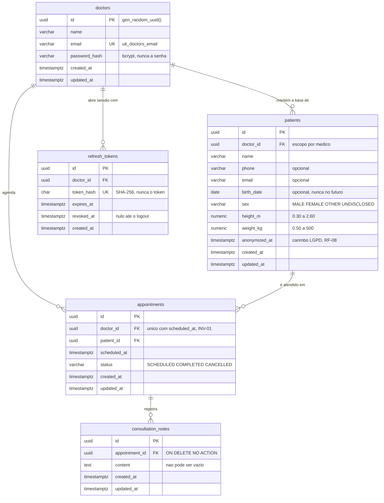

# ProntoMed API

Backend de um prontuário eletrônico de consultório. O médico se autentica, mantém a
própria base de pacientes, opera a agenda — que recusa dois atendimentos no mesmo
horário — e registra as anotações de cada consulta. Quando um paciente exerce o
direito ao esquecimento, a identificação é apagada **sem** perder o histórico de
atendimentos. Há uma única persona, e ela só enxerga o que é seu: isso não é filtro de
tela, é regra do domínio, enforçada em toda leitura e escrita.

Node 22 · TypeScript 5 strict · **NestJS 10** · TypeORM · PostgreSQL 16 ·
Zod (`nestjs-zod`) · Jest + Supertest · Docker Compose. Ambiente de **desenvolvimento
apenas** — a POC é avaliada localmente (ADR-12).

> **Este README é o mapa, não o território.** Ele leva você do clone à avaliação e
> aponta o dono de cada assunto. Cada documento apontado é **autoridade única** sobre o
> que cobre; nada aqui compete com eles. O índice completo está em
> [**Documentação**](#documentação), no fim.

**O desafio.** Resposta a um desafio técnico de backend: API REST com autenticação,
cadastro de pacientes, agenda com regra de conflito, anotações de atendimento,
persistência relacional e documentação executável. A leitura do enunciado, a
interpretação dos wireframes e a rastreabilidade requisito → fase estão em
[`api/docs/PLAN.md`](api/docs/PLAN.md) §1–§3.

## Do clone à validação

**Pré-requisito: Docker. Só isso** — nem Node, nem npm, nem Postgres no host,
inclusive para os testes. Todo comando roda da **raiz** do repositório, e todo comando
de aplicação roda **dentro do container**.

### Subir

| #   | Ação                                         | Comando                                                             |
| --- | -------------------------------------------- | ------------------------------------------------------------------- |
| 1   | Clonar a aplicação                           | `git clone https://github.com/guimourao85/desafio-backend-afya.git` |
| 2   | Entrar no repositório                        | `cd desafio-backend-afya`                                           |
| 3   | Criar o `.env` (não precisa editar nada)     | `cp api/.env.example api/.env`                                      |
| 4   | Subir o ambiente — na 1ª vez builda, ~3 min  | `docker compose up -d`                                              |
| 5   | Conferir que a API está no ar                | `curl localhost:3333/api/health`                                    |
| 6   | Criar as tabelas no banco de desenvolvimento | `docker exec api-prontomed npm run migration:run`                   |
| 7   | Criar a base de demonstração                 | `docker exec api-prontomed npm run seed`                            |
| 8   | Abrir o Swagger e usar a API                 | http://localhost:3333/api/docs                                      |

### Validar

| #   | Ação                                        | Comando                                                |
| --- | ------------------------------------------- | ------------------------------------------------------ |
| 9   | Lint                                        | `docker exec api-prontomed npm run lint`               |
| 10  | Tipos                                       | `docker exec api-prontomed npm run typecheck`          |
| 11  | Compilação                                  | `docker exec api-prontomed npm run build`              |
| 12  | **Testes unitários** — sem banco            | `docker exec api-prontomed npm test`                   |
| 13  | **Testes de integração** — Postgres real    | `docker exec api-prontomed npm run test:e2e`           |
| —   | Derrubar tudo (`-v` apaga também os bancos) | `docker compose down [-v]`                             |

**Os três passos que têm pegadinha:**

- **4** — sobem **dois** containers: API e Postgres. Nada além disso é necessário.
- **6** — **não é opcional, e o passo 5 não denuncia a falta dele:** o healthcheck não
  sonda o banco de propósito. Sem migrations a API sobe verde e quebra na primeira rota
  que tocar uma tabela.
- **7** — cria o médico de [**Credenciais**](#credenciais) — **sem ele não há com que
  autenticar** — mais a base que espelha os wireframes: três pacientes, três consultas
  (duas concluídas com anotação, uma agendada) e um paciente **de propósito sem
  consulta**, que é o caso de linha do tempo vazia. Datas fixas, nunca relativas a hoje.
  **Idempotente:** da segunda execução em diante só reconfirma a senha do `.env`.
- **13** — **auto-contido**: não há nada a preparar antes dele. O `test:e2e` cria as
  tabelas do banco de **teste** por conta própria (são dois bancos, e o e2e nunca toca
  o de desenvolvimento — é o que impede um teste de destruir o seed do passo 7).
  Depois do passo 6 ele roda do zero, quantas vezes você quiser.

Por que os comandos de aplicação rodam com `docker exec`, o que o compose monta e como
os dois bancos nascem: [`api/README.md`](api/README.md#ambiente-de-execução).

<a id="credenciais"></a>

## Credenciais

O seed cria **um** médico, com o par que estiver no `api/.env`. Nos valores que o
`cp api/.env.example api/.env` do passo 3 copia:

| Campo | Valor                  |
| ----- | ---------------------- |
| Email | `medico@prontomed.dev` |
| Senha | `prontomed123`         |

**Sim, a senha está versionada — de propósito, e é segura porque o seed é
fail-closed:** ele recusa rodar com qualquer `APP_ENV` diferente de `dev`
(`api/src/infrastructure/databases/typeorm/postgres/seeds/demo.seed.ts`). Não existe
caminho em que essa credencial chegue a um ambiente que não seja a sua máquina. Trocou
`SEED_DOCTOR_PASSWORD` no `.env`? Rode o seed de novo e o login passa a aceitar a nova.

Este é o **único** lugar do projeto onde o par aparece escrito para ser lido. O Swagger
também o traz preenchido no exemplo do `POST /api/auth/login` — lá ele não é
documentação, é o botão **Execute** funcionando de primeira.

<a id="roteiro"></a>

## Roteiro de avaliação

**Dez passos, cinco atos, tudo pelo `/api/docs`.** Cada ato responde uma pergunta e usa
o que o anterior criou — seguir fora de ordem quebra a corrente. Uns vinte minutos, no
ritmo de quem lê as respostas.

A base já vem populada pelo seed do passo 7, mas os passos 3 e 5 criam **dados
próprios**: o objetivo é ver a criação acontecendo, não só o resultado pronto. Use
sempre o que você criou — cancelar ou anonimizar um registro do seed funciona, e
estraga o estado de demonstração para a próxima leitura.

| Ato          | #   | O que fazer                                                                         | O que confirma                                                                  |
| ------------ | --- | ----------------------------------------------------------------------------------- | ------------------------------------------------------------------------------- |
| **Entrar**   | 1   | `POST /api/auth/login` — o exemplo já vem com a credencial acima                    | 200 com `accessToken` (15 min) e `refreshToken` (8 h, revogável)                |
|              | 2   | **Authorize** no topo, cole o `accessToken` → `GET /api/auth/me`                    | o cadeado fecha e a identidade sai do token, não da URL (INV-04)                |
| **Paciente** | 3   | `POST /api/patients` — **guarde o `id` da resposta**                                | **201** — RF-01                                                                 |
|              | 4   | `GET /api/patients`                                                                 | 200 — RF-02: os pacientes do seed **mais** o seu, paginados                     |
| **Agenda**   | 5   | `POST /api/appointments` com esse `patientId` e uma data futura — **guarde o `id`** | **201** — RF-03                                                                 |
|              | 6   | `POST /api/appointments` **outra vez, no mesmo instante**                           | **409 `SCHEDULE_CONFLICT`** — RF-07 / INV-01                                    |
|              | 7   | `DELETE /api/appointments/:id` do passo 5 → `POST` de novo **no mesmo horário**     | 204 e depois **201** — RF-04: cancelar **devolve** o horário à agenda           |
| **Consulta** | 8   | `POST /api/appointments/:id/notes` na consulta que acabou de nascer no passo 7      | **201** — RF-05                                                                 |
|              | 9   | `GET /api/patients/:id/appointments` com o `id` do passo 3                          | 200 — RF-06: linha do tempo, do mais recente para trás, com as anotações        |
| **LGPD**     | 10  | `DELETE /api/patients/:id` do passo 3 → repita o passo 9 e abra `GET /api/patients/:id` | 204; a timeline mantém o **histórico intacto** e a ficha mostra a **PII apagada** — RF-08, o requisito mais difícil daqui |

**O 409 do passo 6 é só a primeira das duas camadas.** O que você vê é a checagem do
caso de uso, que consulta o horário antes de gravar; ela não resolve duas requisições
**simultâneas**. A segunda camada é um índice único **parcial** no Postgres, e tem
prova própria na suíte de integração — [Concorrência](#concorrência).

**Por que o passo 7 existe:** sem ele, INV-01 fica demonstrada pela metade. Um sistema
que recusa o horário ocupado e **não** o libera de volta no cancelamento está
igualmente errado — e esse defeito não aparece no 409.

**O que isso faz aparecer no passo 9:** a linha do tempo traz **duas** consultas no
mesmo horário — a cancelada, com `status: CANCELLED`, e a que nasceu no lugar dela. Não
é duplicata: cancelar tira o horário da regra de unicidade, não do histórico.

**Por que o passo 10 fecha o roteiro:** o enunciado pede apagar os dados pessoais
_mantendo o histórico de consulta_, e cada lado tem o seu `GET`. Na linha do tempo as
consultas e anotações continuam lá; na ficha o nome virou `Paciente anonimizado` e
telefone, email e nascimento sumiram. A timeline não expõe dado pessoal — de propósito:
é por isso que a anonimização não aparece nela.

O roteiro percorre **9 das 17 rotas**. As outras oito (`health`, `refresh`, `logout`,
detalhe e edição de paciente e de consulta, listagem da agenda) estão no Swagger com
exemplo executável, e ficaram fora porque nenhuma acrescenta requisito que estes dez
passos já não mostrem.

**Este roteiro também roda por máquina:**
[`api/test/roteiro-mcp-playwright/`](api/test/roteiro-mcp-playwright/) dirige o Swagger
real com Playwright — os mesmos cliques, na mesma ordem, com uma asserção por promessa
deste texto. É como as divergências entre o que o roteiro dizia e o que a API fazia
foram encontradas antes de você.

## Requisitos atendidos

**18 dos 20 requisitos do enunciado, e os 11 obrigatórios estão todos entregues.** Os
dois que faltam são desejáveis, saem da mesma decisão e o motivo está na própria linha.

### Funcionais

| ID        | Requisito do enunciado                                                        | Tipo        | Status | Onde conferir                                                                 |
| --------- | ----------------------------------------------------------------------------- | ----------- | ------ | ----------------------------------------------------------------------------- |
| **RF-01** | Cadastrar paciente: nome, telefone, email, nascimento, sexo, altura e peso    | Obrigatório | ✅     | `POST /api/patients` — passo 3. Os sete campos estão no schema e na tabela    |
| **RF-02** | Listar e editar o perfil dos pacientes                                        | Obrigatório | ✅     | `GET /api/patients` — passo 4; `GET` e `PATCH /api/patients/:id` no Swagger   |
| **RF-03** | Cadastrar agendamento de consulta                                             | Obrigatório | ✅     | `POST /api/appointments` — passo 5                                            |
| **RF-04** | Listar, alterar e excluir agendamentos                                        | Obrigatório | ✅     | `GET` e `PATCH` no Swagger; `DELETE /api/appointments/:id` — passo 7          |
| **RF-05** | Anotar uma observação durante a consulta                                      | Obrigatório | ✅     | `POST /api/appointments/:id/notes` — passo 8                                  |
| **RF-06** | Visualizar as anotações das consultas                                         | Obrigatório | ✅     | `GET /api/patients/:id/appointments` — passo 9                                |
| **RF-07** | Não deixar cadastrar dois pacientes na mesma hora                             | Desejável   | ✅     | índice único **parcial** no Postgres + 409 `SCHEDULE_CONFLICT` — passos 6 e 7 |
| **RF-08** | Excluir os dados pessoais mantendo o histórico de consulta (LGPD)             | Desejável   | ✅     | `DELETE /api/patients/:id` — anonimização in-place (ADR-10), passo 10         |

**Como o RF-04 lê "excluir":** o `DELETE` **cancela** — a linha continua no banco com
`status: CANCELLED` e o horário volta a aceitar agendamento. Registro clínico não se
apaga, e é isso que mantém o RF-08 coerente: se a consulta sumisse, não haveria
histórico para preservar quando o paciente é anonimizado.

### Não funcionais

| ID         | Requisito do enunciado                                    | Tipo        | Status | Onde conferir                                                                                    |
| ---------- | --------------------------------------------------------- | ----------- | ------ | -------------------------------------------------------------------------------------------------- |
| **RNF-01** | API REST (HTTP/JSON)                                      | Obrigatório | ✅     | NestJS 10, 17 rotas, verbos e status semânticos, envelope de erro único                          |
| **RNF-02** | Node.js (JavaScript ou TypeScript)                        | Obrigatório | ✅     | Node 22 + TypeScript strict                                                                      |
| **RNF-03** | Documentação da API gerada                                | Obrigatório | ✅     | `/api/docs`, gerado dos **schemas Zod** (`nestjs-zod`) — fonte única (ADR-07)                    |
| **RNF-04** | Dados validados na inserção/atualização                   | Obrigatório | ✅     | Zod na borda + invariantes no domínio + `CHECK`/`UNIQUE` no banco (três camadas)                 |
| **RNF-05** | Testes unitários e/ou de integração                       | Obrigatório | ✅     | as duas camadas, e uma terceira — [**Testes**](#testes)                                          |
| **RNF-06** | Documentação da modelagem do banco (ER)                   | Desejável   | ✅     | [**Modelagem**](#modelagem)                                                                      |
| **RNF-07** | MySQL ou PostgreSQL, com ou sem ORM                       | Desejável   | ✅     | PostgreSQL 16 + TypeORM, migrations geradas e revisadas à mão                                    |
| **RNF-08** | Setup de ambiente com docker/docker-compose               | Desejável   | ✅     | `docker compose up -d` sobe API e banco; Docker é o único pré-requisito   |
| **RNF-09** | Hospedar em ambiente cloud                                | Desejável   | ⛔     | **fora de escopo, por decisão** — ver abaixo                                                     |
| **RNF-10** | Autenticação e/ou autorização                             | Desejável   | ✅     | JWT curto + refresh opaco revogável, guard global — passos 1 e 2                                 |
| **RNF-11** | Ferramenta de lint ou qualidade                           | Desejável   | ✅     | ESLint (com a regra que enforça a fronteira de camadas) + Prettier + `tsc`                       |
| **RNF-12** | Deploy automatizado via pipeline                          | Desejável   | ⛔     | **fora de escopo, por decisão** — ver abaixo                                                     |

**Por que cloud e pipeline ficaram de fora — é uma decisão, não duas.** A POC é avaliada
localmente (ADR-12): sem ambiente de produção, o deploy em cloud provaria que a
aplicação sobe do zero, e isso o `docker compose up -d` já prova em um comando. Sem
cloud, o pipeline não teria para onde publicar — sobraria como executor de lint e teste.
Esses gates existem e rodam **um comando cada** (passos 9 a 14 acima). O CI
automatizaria a chamada; não acrescentaria garantia nenhuma.

### O que o enunciado pede na entrega

| Item                                                    | Status | Onde está                                                                          |
| ------------------------------------------------------- | ------ | ---------------------------------------------------------------------------------- |
| Instruções de como rodar o projeto, no readme           | ✅     | [Do clone à validação](#do-clone-à-validação) — 14 passos, um comando cada         |
| Artefatos: scripts de banco, dados de conexão, etc.     | ✅     | migrations versionadas, `npm run seed`, credenciais e string de conexão no readme |
| Projeto hospedado no git para avaliação                 | ✅     | repositório público no GitHub, `main` sincronizada                                  |

### Como cada item avaliado se comprova

| Item avaliado                        | Onde se comprova                                                                                          |
| ------------------------------------ | --------------------------------------------------------------------------------------------------------- |
| Funcional e não funcional            | as duas tabelas acima — 18 de 20, com os 11 obrigatórios entregues                                        |
| Boas práticas (SOLID, code-smells)   | domínio define a porta, infra implementa (ADR-02); `Either<L,R>` para erro esperado (ADR-05); um caso de uso, um `execute` |
| Estrutura e organização              | camadas explícitas com a fronteira **enforçada por ESLint**, não por convenção — [Arquitetura](#arquitetura) |
| Legibilidade                         | nome por papel (`*.service.ts`, `*.controller.ts`, `*.entity.ts`), código em inglês e mensagens em PT-BR (ADR-13), lint limpo |
| Testes que garantem os requisitos    | três camadas, três perguntas diferentes — [Testes](#testes)                                               |
| Documentação (commits, readme, ER)   | histórico em *conventional commits*, um por entrega; este readme e o [`api/README.md`](api/README.md); ER em [Modelagem](#modelagem) |

<a id="testes"></a>

## Testes

Duas camadas, duas perguntas diferentes — e os **passos 12 e 13** de
[Do clone à validação](#do-clone-à-validação), um comando cada.

| Camada         | Comando                | Escala               | Que pergunta responde                                                                              |
| -------------- | ---------------------- | -------------------- | ---------------------------------------------------------------------------------------------------- |
| **Unitários**  | `npm test`             | 133 casos, 21 suítes | "a regra está certa?" — máquina de estados, invariantes, quem pode o quê. Porta in-memory, **sem banco** |
| **Integração** | `npm run test:e2e`     | 154 casos, 10 suítes | "o sistema inteiro entrega?" — `AppModule` + Supertest + Postgres real. Única camada que prova o que **só o banco** garante |

A divisão não é cerimônia. Há garantias que nenhum teste unitário alcança, porque não
estão no código — estão no schema: o índice único parcial que fecha a corrida do slot
(INV-01), o `CHECK` que recusa anotação vazia por `INSERT` direto, a FK
`ON DELETE NO ACTION` que impede um script manual de sumir com registro clínico.

Estratégia de teste em detalhe — o que cada camada monta, o que é vazamento de
arquitetura: [`api/README.md`](api/README.md#testes).

<a id="concorrência"></a>

### Concorrência

**O 409 que você viu no passo 6 é a checagem do caso de uso, e ela sozinha não basta.**
Duas requisições simultâneas podem passar as duas por ela antes de qualquer uma gravar.
Quem fecha a corrida é um índice único **parcial** no Postgres — parcial porque consulta
cancelada tem de devolver o horário:

```sql
CREATE UNIQUE INDEX uk_appointments_doctor_slot
  ON appointments (doctor_id, scheduled_at)
  WHERE status <> 'CANCELLED';
```

Isso é verificado na suíte, não em prosa: `npm run test:e2e` dispara **20 requisições
simultâneas** no mesmo horário do mesmo médico, com pacientes distintos, e exige
`1× 201`, `19× 409 SCHEDULE_CONFLICT` e **uma** linha viva no banco.

E o teste tem a prova de que testa. Um teste de corrida fica verde sem nunca ter havido
corrida, se as requisições serializarem — a saída é idêntica à do sistema correto. Então
ele foi rodado uma vez com o índice **removido**: aí **3 das 20** entram, e o overbooking
acontece. É o número que separa "o `if` está segurando" de "o banco está segurando".

**Retry ainda não tem prova, e é escolha declarada:** não há `Idempotency-Key`, então
`POST /api/patients` repetido cria duas linhas (o agendamento é exceção — a chave
natural transforma o retry em 409). O porquê e o gatilho de reabertura estão em
**DEBT-05**, [`DEBITOS-TECNICOS.md`](api/docs/DEBITOS-TECNICOS.md).

## Arquitetura

Cinco linhas, e o documento inteiro logo abaixo:

- **Camadas** — `domains/domain` (entities com comportamento, casos de uso, portas) ·
  `gateways/http` (controllers, schemas Zod) · `infrastructure` (TypeORM, migrations,
  adapters) · `framework` (auth, cripto, filtros) · `presentation` (presenters).
- **A dependência aponta para dentro:** `gateways → services → portas ← infrastructure`.
  O caso de uso não conhece TypeORM, Express, bcrypt nem JWT — e quem impede não é
  disciplina, é uma regra de ESLint que quebra o build.
- **Agregados** — `Doctor`, `Patient`, `Appointment` (raiz, com a anotação dentro) e
  `RefreshSession`. Referenciam-se **por ID**, sem relação navegável entre si, e uma
  transação toca um agregado só (ADR-04).
- **DI é a do Nest**, com `*.module.ts` + `*.provider.ts`: o provider entrega o
  **adapter** que implementa a porta, nunca o `Repository<T>` cru (ADR-02).
- **A entity é a do TypeORM**, com os métodos de regra dentro (ADR-03) — é ela que
  declara os nomes de constraint que o `migration:generate` usa.

Autoridade sobre arquitetura: **[`api/README.md`](api/README.md)** — camadas em
detalhe, injeção de dependência, contrato de erro, persistência, ambiente de execução e
estratégia de teste. Nada disso é repetido aqui.

<a id="modelagem"></a>

## Modelagem

Cinco tabelas, cinco chaves estrangeiras. O diagrama foi lido das **quatro migrations
aplicadas** — não das entities: a migration é o que está no banco.



O que o desenho não mostra, e é onde mora a garantia:
**`uk_appointments_doctor_slot`** é `UNIQUE (doctor_id, scheduled_at)` **`WHERE status
<> 'CANCELLED'`** — é a segunda camada de INV-01, e é o `WHERE` que devolve o horário no
cancelamento (passo 7). E **não há `DELETE` de paciente**: `anonymized_at` é o que
"excluir" significa nesta tabela (ADR-10), porque apagar a linha quebraria a FK que
preserva o histórico.

Autoridade sobre modelagem — inventário de tabelas, relacionamentos e as decisões de
banco com o preço de cada uma: [`PRODUCT.md §banco`](api/docs/PRODUCT.md). O SQL literal
está nas migrations, em `api/src/infrastructure/databases/typeorm/postgres/migrations/`.

## Decisões e limites

**As ADRs.** Autoridade em [`PRODUCT.md §adrs`](api/docs/PRODUCT.md), onde cada uma tem
alternativa rejeitada e preço declarado. A tabela abaixo é **duplicação consciente** —
um resumo de uma linha existe aqui porque a decisão é o que o avaliador precisa ver numa
passada, e mandá-lo abrir outro arquivo para isso custaria mais do que o drift:

| ADR    | Decisão                                                                         |
| ------ | ------------------------------------------------------------------------------- |
| **01** | NestJS 10 com a DI do próprio framework, na estrutura de pastas de referência   |
| **02** | Domínio define portas; o provider entrega o **adapter**, não o `Repository<T>`  |
| **03** | A entity **é** a do TypeORM, com comportamento — sem modelo paralelo nem mapper |
| **04** | Agregados se referenciam por ID; uma transação toca um agregado                 |
| **05** | `Either<L,R>` para erro esperado; exceção só para o inesperado                  |
| **06** | Erro de domínio carrega `code` estável **e** mensagem em PT-BR                  |
| **07** | Zod na borda é fonte única da validação **e** do Swagger                        |
| **08** | Migration gerada, revisada por humano, forward-only; `synchronize: false`       |
| **09** | Invariante crítica é enforçada **também** no banco                              |
| **10** | LGPD por anonimização in-place, nunca `DELETE` nem soft-delete                  |
| **11** | JWT curto + refresh opaco revogável, **sem rotação** (preço em DEBT-11)         |
| **12** | Somente ambiente de desenvolvimento — produção aqui seria cenografia            |
| **13** | Código e banco em inglês; mensagem ao usuário em PT-BR                          |

> Divergiu do `PRODUCT.md`? **`PRODUCT.md` vence**, e quem se corrige é esta tabela.

**Os limites.** Autoridade em [`DEBITOS-TECNICOS.md`](api/docs/DEBITOS-TECNICOS.md),
com severidade e **gatilho de reabertura** de cada um. Os quatro que importam para quem
está avaliando — os dois ALTOS, e dois em que o roteiro acima esbarra:

| Débito                            | O que é                                                                                                                                                                                                             |
| --------------------------------- | ------------------------------------------------------------------------------------------------------------------------------------------------------------------------------------------------------------------- |
| **DEBT-01** · ALTO · privacidade  | Anonimizar o paciente **não** apaga o que o médico escreveu sobre ele em texto livre. Fechar isso do jeito óbvio destruiria o histórico que o próprio RF-08 manda preservar — a solução é de produto, não de código |
| **DEBT-07** · ALTO · segurança    | Não há rate limiting no login: nada impede tentar milhares de senhas. O custo do bcrypt atrasa, não impede                                                                                                          |
| **DEBT-02** · MÉDIO · domínio     | A agenda barra duas consultas no **mesmo instante** (passo 6), não duas que se atropelam — o modelo do desafio não tem duração de consulta                                                                          |
| **DEBT-05** · MÉDIO · arquitetura | Sem `Idempotency-Key`: repetir um `POST` cria um segundo recurso, exceto no agendamento, onde a chave natural transforma o retry em 409                                                                             |

O que ficou de fora **por decisão**, e não por falta de tempo: produção e cloud
(ADR-12) · pipeline de CI (RNF-12) · Redis, filas e eventos de domínio · RBAC com
múltiplos papéis (DEBT-08) · frontend.

**Portas:** API em `3333`. Postgres em **`5433` no host** (dentro da rede Docker
continua `5432`) — 5432 pode estar ocupada por outro projeto na mesma máquina.

## Documentação

Cada assunto tem **um** dono. Este README aponta; a autoridade decide.

| Se você quer                                                                                   | Autoridade                                                               |
| ---------------------------------------------------------------------------------------------- | ------------------------------------------------------------------------ |
| **Exercitar a API**                                                                            | `/api/docs`, com o ambiente de pé                                        |
| Entender **como o backend é construído** — camadas, DI, contrato de erro, persistência, ambiente de execução, testes | [`api/README.md`](api/README.md)                    |
| Entender **o produto e o domínio** — personas, jornadas, agregados, invariantes, ADRs, banco   | [`api/docs/PRODUCT.md`](api/docs/PRODUCT.md)                             |
| Ver o **plano de execução** — requisitos, fases na ordem, contratos HTTP, padrões de código    | [`api/docs/PLAN.md`](api/docs/PLAN.md)                                   |
| Saber **o que ficou de fora e por quê**, com gatilho de reabertura                             | [`api/docs/DEBITOS-TECNICOS.md`](api/docs/DEBITOS-TECNICOS.md)           |
| Acompanhar **como cada sprint foi executada** — decisões, issues, scores de review             | [`api/docs/desenvolvimento/sprints/`](api/docs/desenvolvimento/sprints/) |
| Reexecutar o **roteiro de avaliação por máquina**                                              | [`api/test/roteiro-mcp-playwright/`](api/test/roteiro-mcp-playwright/)   |
| Saber **como escrever doc** neste repositório                                                  | [`api/docs/DOC-STANDARDS.md`](api/docs/DOC-STANDARDS.md)                 |
