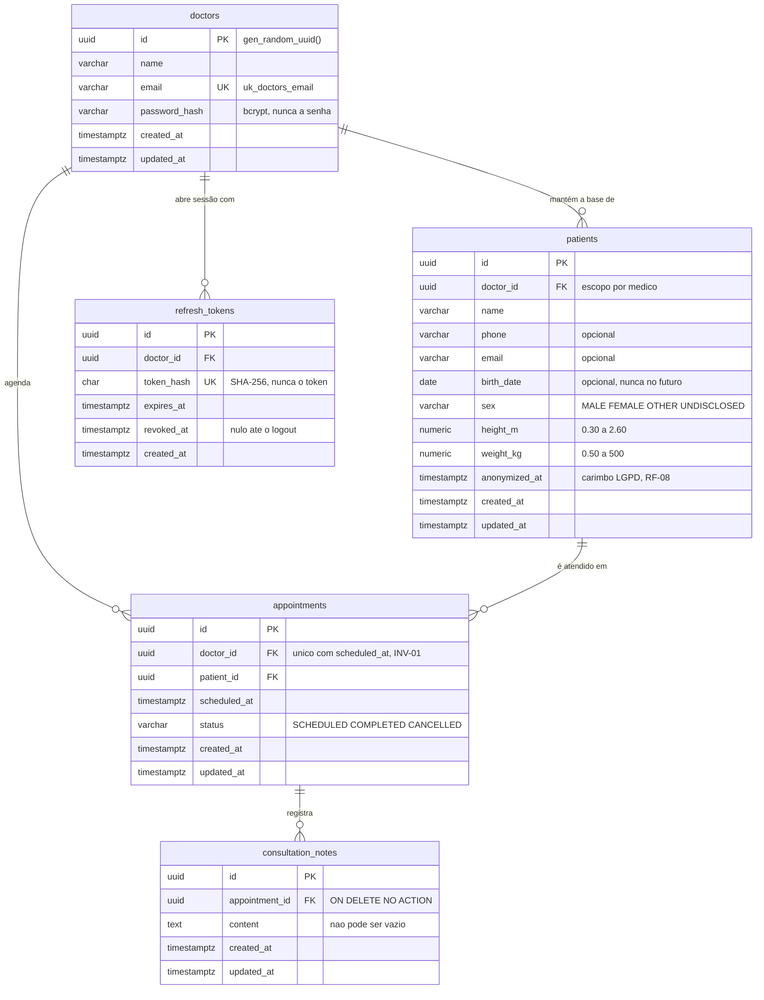

# ProntoMed API

Backend de um prontuário eletrônico de consultório. O médico se autentica, mantém a
própria base de pacientes, opera a agenda — que recusa dois atendimentos no mesmo
horário — e registra as anotações de cada consulta. Quando um paciente exerce o
direito ao esquecimento, a identificação é apagada **sem** perder o histórico de
atendimentos.

Há uma única persona e ela só enxerga o que é seu: paciente, agenda e anotação de
outro médico não existem para ela. Isso não é filtro de tela — é regra do domínio,
enforçada em toda leitura e escrita.

**O desafio.** Resposta a um desafio técnico de backend: API REST com autenticação,
cadastro de pacientes, agenda com regra de conflito, anotações de atendimento,
persistência relacional e documentação executável. A leitura do enunciado, a
interpretação dos wireframes e a rastreabilidade requisito → fase estão em
[`api/docs/PLAN.md`](api/docs/PLAN.md) §1–§3.

## Do clone à validação

**Pré-requisito: Docker. Só isso** — nem Node, nem npm, nem Postgres no host,
inclusive para os testes. Todo comando roda da **raiz** do repositório, e todo
comando de aplicação roda **dentro do container** (o porquê está logo abaixo da
tabela).

### Subir

| #   | Ação                                         | Comando                                                             |
| --- | -------------------------------------------- | ------------------------------------------------------------------- |
| 1   | Clonar a aplicação                           | `git clone https://github.com/guimourao85/desafio-backend-afya.git` |
| 2   | Entrar no repositório                        | `cd desafio-backend-afya`                                           |
| 3   | Criar o `.env` (não precisa editar nada)     | `cp api/.env.example api/.env`                                      |
| 4   | Subir o ambiente — na 1ª vez builda, ~3 min  | `docker compose up -d`                                              |
| 5   | Conferir que a API está no ar                | `curl localhost:3333/api/health`                                    |
| 6   | Criar as tabelas no banco de desenvolvimento | `docker exec api-prontomed npm run migration:run`                   |
| 7   | Criar a base de demonstração                 | `docker exec api-prontomed npm run seed`                            |
| 8   | Abrir o Swagger e usar a API                 | http://localhost:3333/api/docs                                      |

### Validar

| #   | Ação                                        | Comando                                                |
| --- | ------------------------------------------- | ------------------------------------------------------ |
| 9   | Lint                                        | `docker exec api-prontomed npm run lint`               |
| 10  | Tipos                                       | `docker exec api-prontomed npm run typecheck`          |
| 11  | Compilação                                  | `docker exec api-prontomed npm run build`              |
| 12  | **Testes unitários** — sem banco            | `docker exec api-prontomed npm test`                   |
| 13  | Criar as tabelas no banco de **teste**      | `docker exec api-prontomed npm run migration:run:test` |
| 14  | **Testes de integração** — Postgres real    | `docker exec api-prontomed npm run test:e2e`           |
| —   | Derrubar tudo (`-v` apaga também os bancos) | `docker compose down [-v]`                             |

**Sobre os passos que têm pegadinha:**

3. Os valores do exemplo sobem o ambiente inteiro, inclusive um `JWT_SECRET` que
   satisfaz o mínimo de 32 caracteres do schema. Fora de `localhost`, troque:
   `openssl rand -base64 48`.
4. O compose cria o volume, roda `api/db/init-test-db.sh` para criar os dois bancos
   (`prontomed` e `prontomed_test`) e só então sobe a API — quem garante a ordem é o
   `depends_on: service_healthy`.
5. Resposta esperada: `{"status":"ok"}`. Se demorar, a API ainda está compilando —
   `docker logs api-prontomed --tail 20` até aparecer `successfully started`.
6. **Não é opcional, e o passo 5 não denuncia a falta dele:** o healthcheck não sonda
   o banco de propósito (`api/docs/PLAN.md §13 F0`). Sem migrations a API sobe verde e
   só quebra na primeira rota que tocar uma tabela.
7. Cria o médico com a credencial de `SEED_DOCTOR_EMAIL` / `SEED_DOCTOR_PASSWORD` do
   `.env` — o par exato está em [**Credenciais**](#credenciais), logo abaixo. É por
   ele que se faz o login do passo 8; **sem este passo não há com que autenticar**.
   Junto com o médico vem a base que espelha os wireframes: **três pacientes**
   (Pedro, Eduardo e Bruno), **três consultas** — duas concluídas, cada uma com sua
   anotação, e uma agendada — e **Bruno de propósito sem consulta nenhuma**, que é o
   caso de linha do tempo vazia. Datas fixas (2026 e 2027), nunca relativas a hoje.
   **Pode rodar quantas vezes quiser:** a partir da segunda execução o script apenas
   reconfirma a senha do `.env` e **não insere mais nada** — não duplica paciente nem
   colide no horário da agenda. Trocou `SEED_DOCTOR_PASSWORD`? Rode de novo e o login
   passa a aceitar a nova.
8. O Swagger é a ferramenta de avaliação: cada endpoint é executável dali (documento
   cru em `/api/docs-json`). Todo corpo tem exemplo executável, e todo erro
   documentado (400, 401, 404, 409, 422) mostra o payload exato que a API devolve.
   O que fazer depois de abrir está no [**Roteiro de avaliação**](#roteiro).
9. Comando **separado** do passo 6 de propósito: são dois bancos no mesmo container,
   e o e2e nunca toca o de desenvolvimento — é o que impede um teste de destruir o
   seed do passo 7. **Pular este passo faz o passo 14 quebrar** com
   `relation does not exist`.

## Credenciais

O seed cria **um** médico, com o par que estiver no `api/.env`. Nos valores que o
`cp api/.env.example api/.env` do passo 3 copia:

| Campo | Valor                  |
| ----- | ---------------------- |
| Email | `medico@prontomed.dev` |
| Senha | `prontomed123`         |

**Sim, a senha está versionada — de propósito, e é segura porque o seed é
fail-closed:** ele recusa rodar com qualquer `APP_ENV` diferente de `dev`
(`api/src/infrastructure/databases/typeorm/postgres/seeds/demo.seed.ts`). Não existe
caminho em que essa credencial chegue a um ambiente que não seja a sua máquina. Trocou
`SEED_DOCTOR_PASSWORD` no `.env`? Rode o seed de novo e o login passa a aceitar a nova.

Este é o **único** lugar do projeto onde o par aparece escrito para ser lido. O
Swagger também o traz preenchido no exemplo do `POST /api/auth/login` — lá ele não é
documentação, é o botão **Execute** funcionando de primeira.

## Roteiro de avaliação

**Dez passos, cinco atos, tudo pelo `/api/docs`.** Cada ato responde uma pergunta, e
usa o que o anterior criou — seguir fora de ordem quebra a corrente. Uns vinte minutos,
no ritmo de quem lê as respostas.

A base já vem populada pelo seed do passo 7, mas os passos 3 e 5 criam **dados
próprios**: o objetivo é ver a criação acontecendo, não só o resultado pronto. Use
sempre o que você criou — cancelar ou anonimizar um registro do seed funciona, e
estraga o estado de demonstração para a próxima leitura.

| Ato          | #   | O que fazer                                                                         | O que confirma                                                                  |
| ------------ | --- | ----------------------------------------------------------------------------------- | ------------------------------------------------------------------------------- |
| **Entrar**   | 1   | `POST /api/auth/login` — o exemplo já vem com a credencial acima                    | 200 com `accessToken` (15 min) e `refreshToken` (8 h, revogável)                |
|              | 2   | **Authorize** no topo, cole o `accessToken` → `GET /api/auth/me`                    | o cadeado fecha e a identidade sai do token, não da URL (INV-04)                |
| **Paciente** | 3   | `POST /api/patients` — **guarde o `id` da resposta**                                | **201** — RF-01                                                                 |
|              | 4   | `GET /api/patients`                                                                 | 200 — RF-02: os pacientes do seed **mais** o seu, paginados                     |
| **Agenda**   | 5   | `POST /api/appointments` com esse `patientId` e uma data futura — **guarde o `id`** | **201** — RF-03                                                                 |
|              | 6   | `POST /api/appointments` **outra vez, no mesmo instante**                           | **409 `SCHEDULE_CONFLICT`** — RF-07 / INV-01                                    |
|              | 7   | `DELETE /api/appointments/:id` do passo 5 → `POST` de novo **no mesmo horário**     | 204 e depois **201** — RF-04: cancelar **devolve** o horário à agenda           |
| **Consulta** | 8   | `POST /api/appointments/:id/notes` na consulta que acabou de nascer no passo 7      | **201** — RF-05                                                                 |
|              | 9   | `GET /api/patients/:id/appointments` com o `id` do passo 3                          | 200 — RF-06: linha do tempo, do mais recente para trás, com as anotações        |
| **LGPD**     | 10  | `DELETE /api/patients/:id` do passo 3 → **repita o passo 9**                        | 204, PII apagada, **histórico intacto** — RF-08, o requisito mais difícil daqui |

**Sobre o 409 do passo 6:** o que você vê é a checagem do caso de uso — ela consulta o
horário antes de gravar. A segunda camada é um índice único **parcial** no Postgres, e
ela existe porque a primeira não resolve duas requisições **simultâneas**: as duas
consultam antes de qualquer uma gravar, e as duas passam. Pelo Swagger, em sequência,
só a primeira camada é exercitada — a segunda está no banco desde a F4 e ainda não foi
provada sob corrida ([o que estes testes ainda não provam](#testes)).

**Por que o passo 7 existe:** sem ele, INV-01 fica demonstrada pela metade. Um sistema
que recusa o horário ocupado e **não** o libera de volta no cancelamento está
igualmente errado — só que o defeito não aparece no 409.

**O que isso faz aparecer no passo 9:** a linha do tempo vai trazer **duas** consultas
no mesmo horário — a que você cancelou, com `status: CANCELLED`, e a que nasceu no
lugar dela. Não é duplicata: cancelar tira o horário da regra de unicidade, não do
histórico. O prontuário guarda que houve um cancelamento.

**Por que o passo 10 fecha o roteiro:** o enunciado pede apagar os dados pessoais
_mantendo o histórico de consulta_. Os dois lados são visíveis no mesmo `GET`: o nome
vira `Paciente anonimizado`, telefone, email e nascimento somem — e as consultas, com
as anotações, continuam lá.

O roteiro percorre **9 das 17 rotas**. As outras oito (`health`, `refresh`, `logout`,
detalhe e edição de paciente e de consulta, listagem da agenda) estão no Swagger com
exemplo executável, e ficaram fora porque nenhuma acrescenta requisito que estes dez
passos já não mostrem.

## Requisitos atendidos

Requisito não envelhece; o que muda é a coluna da direita. **Funcionais** (§1.1 do
[`PLAN.md`](api/docs/PLAN.md)):

| ID        | Requisito                                   | Tipo        | Onde está                                                                     |
| --------- | ------------------------------------------- | ----------- | ----------------------------------------------------------------------------- |
| **RF-01** | Cadastrar paciente                          | Obrigatório | `POST /api/patients` — passo 3                                                |
| **RF-02** | Listar e editar o perfil dos pacientes      | Obrigatório | `GET /api/patients` — passo 4; `GET`/`PATCH /api/patients/:id` no Swagger     |
| **RF-03** | Cadastrar agendamento                       | Obrigatório | `POST /api/appointments` — passo 5                                            |
| **RF-04** | Listar, alterar e excluir agendamentos      | Obrigatório | `DELETE /api/appointments/:id` — passo 7; `GET` e `PATCH` no Swagger          |
| **RF-05** | Anotar uma observação durante a consulta    | Obrigatório | `POST /api/appointments/:id/notes` — passo 8                                  |
| **RF-06** | Visualizar as anotações das consultas       | Obrigatório | `GET /api/patients/:id/appointments` — passo 9                                |
| **RF-07** | Não permitir dois pacientes na mesma hora   | Desejável   | índice único **parcial** no Postgres + 409 `SCHEDULE_CONFLICT` — passos 6 e 7 |
| **RF-08** | Excluir dados pessoais mantendo o histórico | Desejável   | `DELETE /api/patients/:id` — anonimização in-place (ADR-10), passo 10         |

**Não funcionais** (§1.2):

| ID         | Requisito                        | Tipo        | Onde está                                                                                          |
| ---------- | -------------------------------- | ----------- | -------------------------------------------------------------------------------------------------- |
| **RNF-01** | API REST (HTTP/JSON)             | Obrigatório | NestJS 10, verbos e status semânticos, envelope de erro único                                      |
| **RNF-02** | Node.js (JS ou TS)               | Obrigatório | Node 22 + TypeScript strict                                                                        |
| **RNF-03** | Documentação da API gerada       | Obrigatório | `/api/docs`, gerado dos **schemas Zod** (`nestjs-zod`) — fonte única (ADR-07)                      |
| **RNF-04** | Dados validados na escrita       | Obrigatório | Zod na borda + invariantes no domínio + `CHECK`/`UNIQUE` no banco (três camadas)                   |
| **RNF-05** | Testes unitários e/ou integração | Obrigatório | as duas camadas — [**Testes**](#testes)                                                            |
| **RNF-06** | Documentação da modelagem (ER)   | Desejável   | [**Modelagem**](#modelagem)                                                                        |
| **RNF-07** | MySQL ou PostgreSQL              | Desejável   | PostgreSQL 16 + TypeORM, migrations geradas e revisadas à mão                                      |
| **RNF-08** | Setup com docker-compose         | Desejável   | `docker compose up -d` sobe API e banco; Docker é o único pré-requisito                            |
| **RNF-09** | Hospedar em cloud                | Desejável   | **fora de escopo, por decisão** — ADR-12: a POC é avaliada localmente                              |
| **RNF-10** | Autenticação/autorização         | Desejável   | JWT curto + refresh opaco revogável, guard global — passos 1 e 2                                   |
| **RNF-11** | Lint / qualidade                 | Desejável   | ESLint (com a regra que enforça a fronteira de camadas) + Prettier + `tsc`                         |
| **RNF-12** | Pipeline automatizado (CI)       | Desejável   | **fora de escopo, por decisão** — cortado pelo prisma de simplicidade (`PLAN.md §3.1`), sem débito |

Os dois "fora de escopo" são **escolha declarada, não lacuna**: os gates que um
pipeline rodaria são os passos 9 a 14 de [Do clone à validação](#do-clone-à-validação)
— eles existem hoje, e rodam com um comando cada.

## Stack

Node 22 · TypeScript 5 strict · **NestJS 10** · TypeORM · PostgreSQL 16 ·
Zod (`nestjs-zod`) · Jest + Supertest · Docker Compose.

Ambiente de **desenvolvimento apenas** — a POC é avaliada localmente.

## Testes

Os comandos são os **passos 12 a 14** de [Do clone à validação](#do-clone-à-validação).
Aqui está o que cada camada prova — e por que são duas.

| Camada         | Comando            | Escala               | O que prova                                                                                                                                                                                                                                         |
| -------------- | ------------------ | -------------------- | --------------------------------------------------------------------------------------------------------------------------------------------------------------------------------------------------------------------------------------------------- |
| **Unitários**  | `npm test`         | 133 casos, 21 suítes | Regra de negócio isolada: máquina de estados da consulta, invariantes, quem pode o quê. Repositório in-memory implementando a mesma porta — **não toca o banco**, roda em segundos                                                                  |
| **Integração** | `npm run test:e2e` | 153 casos, 10 suítes | Sobe o `AppModule` inteiro e bate no Postgres de verdade, via HTTP com Supertest. É a única camada que prova o que **só o banco** garante — e, desde a F6, que o documento OpenAPI não tem rota sem `summary`, sem exemplo ou sem o 401 documentado |

A divisão não é cerimônia. Há garantias que nenhum teste unitário alcança, porque
elas não estão no código — estão no schema:

- o índice único **parcial** que recusa dois agendamentos vivos no mesmo instante, e continua liberando o horário depois de um cancelamento (INV-01);
- o `CHECK` que recusa uma anotação vazia mesmo por `INSERT` direto, por baixo da validação HTTP;
- a FK `ON DELETE NO ACTION` que recusa apagar uma consulta que tem anotação — a rede que impede um script manual de sumir com registro clínico.

### O que estes testes ainda não provam

Nenhuma das duas camadas exercita **concorrência, volume ou retry**. Dito sem
eufemismo: as rotas estão corretas e **não provadas sob estresse**.

| Não provado                                         | O que existe hoje                                                                                                                                                                                                             | Onde a prova vai |
| --------------------------------------------------- | ----------------------------------------------------------------------------------------------------------------------------------------------------------------------------------------------------------------------------- | ---------------- |
| Duas requisições **simultâneas** no mesmo horário   | O índice único parcial acima está no banco desde a F4, e é a única defesa real contra a corrida. Testado está que ele **existe** e rejeita o segundo agendamento — não que ele resolve o empate de dois `INSERT` concorrentes | Sprint 06.01     |
| `POST` repetido por retry criando recurso duplicado | Só o agendamento tem chave natural que barra o segundo (409 determinístico). Os demais `POST` não têm `Idempotency-Key`                                                                                                       | Sprint 06.01     |
| Comportamento sob **volume**                        | Nenhum teste de carga. A busca de pacientes usa `ILIKE` sem índice de texto e a paginação é por `OFFSET` — escolhas dimensionadas para um consultório, não para volume                                                        | Sprint 06.01     |

Isto é escolha declarada, não esquecimento: a regra está em
[`PLAN.md §3.2`](api/docs/PLAN.md) — sprint de feature entrega a regra, a sprint
dedicada entrega a prova sob estresse. Cada limite acima tem entrada própria, com
gatilho de reabertura, em
[`DEBITOS-TECNICOS.md`](api/docs/DEBITOS-TECNICOS.md). Se a 06.01 não fechar até a
entrega, esta tabela é o registro do que ficou sem prova.

> **Por que `docker exec` em vez de `npm test` direto.** O compose monta um volume
> anônimo em `/usr/src/app/node_modules` para preservar as dependências da imagem, e
> por isso **não existe `node_modules` no host** — `npm test` na raiz responde
> `jest: not found`. Rodar no host é possível, mas só se `npm install` vier **antes**
> do primeiro `docker compose up`: depois disso o daemon já criou o ponto de montagem
> como `root`, e o `npm install` falha com `EACCES` até você apagar `api/node_modules`
> com `sudo`. Dentro do container o problema não existe.

> **Verde vale, mas confira a contagem.** O script é `jest --passWithNoTests`: se um
> dia o jest não encontrar nenhum arquivo de teste, ele sai **com sucesso** em vez de
> falhar. O output sempre diz quantas suítes rodaram — é esse número que confirma.

## Arquitetura

Cinco linhas, e nenhuma delas repetida de outro documento:

- **Camadas** — `domains/domain` (entities com comportamento, casos de uso, portas) ·
  `gateways/http` (controllers, schemas Zod) · `infrastructure` (TypeORM, migrations,
  adapters) · `framework` (auth, cripto, filtros) · `presentation` (presenters).
- **A dependência aponta para dentro:** `gateways → services → portas ← infrastructure`.
  O caso de uso não conhece TypeORM, Express, bcrypt nem JWT — e quem impede não é
  disciplina, é uma regra de ESLint que quebra o build.
- **Agregados** — `Doctor`, `Patient`, `Appointment` (raiz, com a anotação dentro) e
  `RefreshSession`. Eles se referenciam **por ID**, sem relação navegável entre si, e
  uma transação toca um agregado só (ADR-04).
- **DI é a do Nest**, com `*.module.ts` + `*.provider.ts`: o provider entrega o
  **adapter** que implementa a porta, nunca o `Repository<T>` cru (ADR-02).
- **A entity é a do TypeORM**, com os métodos de regra dentro (ADR-03) — é ela que
  declara os nomes de constraint que o `migration:generate` usa.

O documento de arquitetura é **[`api/README.md`](api/README.md)**: camadas em detalhe,
injeção de dependência, contrato de erro, persistência e estratégia de teste. Nada
disso é repetido aqui.

## Modelagem

Cinco tabelas, cinco chaves estrangeiras. O diagrama abaixo foi lido das **quatro
migrations aplicadas** — não das entities: a migration é o que está no banco.

O que o desenho não mostra, e é onde mora a garantia:

- **`uk_appointments_doctor_slot`** é `UNIQUE (doctor_id, scheduled_at)` **`WHERE
status <> 'CANCELLED'`**. É a segunda camada de INV-01 — a que fecha a corrida que
  nenhum `if` fecha — e é o `WHERE` que devolve o horário no cancelamento (passo 7).
- **Quatro das cinco FKs foram escritas à mão** na revisão das migrations: como
  agregados se referenciam por ID (ADR-04), o gerador não tinha relação de onde
  derivá-las. A única que ele emitiu sozinho é `consultation_notes → appointments`,
  porque a anotação é entidade **interna** do agregado.
- **`consultation_notes` não tem `doctor_id`**, de propósito: o escopo vem da raiz. Uma
  segunda cópia poderia divergir e apontar para outro consultório.
- **Não há `DELETE` de paciente**: `anonymized_at` é o que "excluir" significa nesta
  tabela (ADR-10). Apagar a linha quebraria a FK que preserva o histórico.

Inventário e decisões de modelagem: [`PRODUCT.md §banco`](api/docs/PRODUCT.md). O SQL
literal está nas migrations, em `api/src/infrastructure/databases/typeorm/postgres/migrations/`.

## Decisões e limites

**As decisões arquiteturais**, cada uma com alternativa rejeitada e preço declarado em
[`PRODUCT.md §adrs`](api/docs/PRODUCT.md) — aqui vai o resumo de uma linha:

| ADR    | Decisão                                                                         |
| ------ | ------------------------------------------------------------------------------- |
| **01** | NestJS 10 com a DI do próprio framework, na estrutura de pastas de referência   |
| **02** | Domínio define portas; o provider entrega o **adapter**, não o `Repository<T>`  |
| **03** | A entity **é** a do TypeORM, com comportamento — sem modelo paralelo nem mapper |
| **04** | Agregados se referenciam por ID; uma transação toca um agregado                 |
| **05** | `Either<L,R>` para erro esperado; exceção só para o inesperado                  |
| **06** | Erro de domínio carrega `code` estável **e** mensagem em PT-BR                  |
| **07** | Zod na borda é fonte única da validação **e** do Swagger                        |
| **08** | Migration gerada, revisada por humano, forward-only; `synchronize: false`       |
| **09** | Invariante crítica é enforçada **também** no banco                              |
| **10** | LGPD por anonimização in-place, nunca `DELETE` nem soft-delete                  |
| **11** | JWT curto + refresh opaco revogável, **sem rotação** (preço em DEBT-11)         |
| **12** | Somente ambiente de desenvolvimento — produção aqui seria cenografia            |
| **13** | Código e banco em inglês; mensagem ao usuário em PT-BR                          |

**E os limites.** O ledger completo, com severidade e **gatilho de reabertura** de
cada um, está em [`DEBITOS-TECNICOS.md`](api/docs/DEBITOS-TECNICOS.md). Os que
importam para quem está avaliando são estes quatro — os dois de severidade ALTA, e
dois em que o roteiro acima esbarra:

| Débito                            | O que é                                                                                                                                                                                                             |
| --------------------------------- | ------------------------------------------------------------------------------------------------------------------------------------------------------------------------------------------------------------------- |
| **DEBT-01** · ALTO · privacidade  | Anonimizar o paciente **não** apaga o que o médico escreveu sobre ele em texto livre. Fechar isso do jeito óbvio destruiria o histórico que o próprio RF-08 manda preservar — a solução é de produto, não de código |
| **DEBT-07** · ALTO · segurança    | Não há rate limiting no login: nada impede tentar milhares de senhas. O custo do bcrypt atrasa, não impede                                                                                                          |
| **DEBT-02** · MÉDIO · domínio     | A agenda barra duas consultas no **mesmo instante** (passo 6), não duas que se atropelam — o modelo do desafio não tem duração de consulta                                                                          |
| **DEBT-05** · MÉDIO · arquitetura | Sem `Idempotency-Key`: repetir um `POST` cria um segundo recurso, exceto no agendamento, onde a chave natural transforma o retry em 409                                                                             |

O que ficou de fora **por decisão**, e não por falta de tempo: produção e cloud
(ADR-12) · pipeline de CI (RNF-12) · Redis, filas e eventos de domínio · RBAC com
múltiplos papéis (DEBT-08) · frontend.

## Comandos

| Comando                               | O que faz                                                                |
| ------------------------------------- | ------------------------------------------------------------------------ |
| `docker compose up -d` / `down`       | sobe / derruba o ambiente                                                |
| `docker compose down -v`              | derruba **apagando o volume** — necessário para recriar `prontomed_test` |
| `docker logs api-prontomed --tail 50` | logs da API                                                              |
| `docker exec -it api-prontomed sh`    | shell dentro do container, para encadear vários `npm run`                |

Os scripts abaixo rodam com `docker exec api-prontomed npm run <script>` — ou direto,
de dentro de `api/`, se você tiver Node no host:

| Script                               | O que faz                                                                       |
| ------------------------------------ | ------------------------------------------------------------------------------- |
| `lint` · `typecheck` · `build`       | gates de código                                                                 |
| `test` · `test:e2e`                  | unitários · integração                                                          |
| `seed`                               | cria o médico com a credencial do `.env` e a base de demonstração — idempotente |
| `migration:run`                      | aplica as migrations no banco de **desenvolvimento**                            |
| `migration:run:test`                 | as mesmas migrations no `prontomed_test` — o banco que o e2e usa                |
| `migration:generate --name=<escopo>` | gera a migration a partir das entities, para **revisão** antes do commit        |
| `migration:revert`                   | desfaz a última migration aplicada                                              |

**Portas:** API em `3333`. Postgres em **`5433` no host** (dentro da rede Docker
continua `5432`) — 5432 pode estar ocupada por outro projeto na mesma máquina.

**Bancos:** `prontomed` (desenvolvimento) e `prontomed_test`, ambos no mesmo
container. O `prontomed_test` é criado por `api/db/init-test-db.sh`, que o Postgres
roda **só no primeiro boot do volume** — se ele não existir, `docker compose down -v`
e suba de novo.

**Migrations:** rodam por comando, nunca no boot — e são **dois** bancos, portanto
dois comandos. O porquê disso e o fluxo de geração e revisão estão em
[`api/README.md`](api/README.md#persistência).

## Documentação

Cada assunto tem **um** dono; os outros documentos apontam para ele.

| Se você quer                                                                                   | Vá para                                                                  |
| ---------------------------------------------------------------------------------------------- | ------------------------------------------------------------------------ |
| Entender **como o backend é construído** — camadas, DI, contrato de erro, persistência, testes | [`api/README.md`](api/README.md)                                         |
| Entender **o produto e o domínio** — personas, jornadas, agregados, invariantes, ADRs          | [`api/docs/PRODUCT.md`](api/docs/PRODUCT.md)                             |
| Ver o **plano de execução** — requisitos, fases na ordem, contratos HTTP, padrões de código    | [`api/docs/PLAN.md`](api/docs/PLAN.md)                                   |
| Saber **o que ficou de fora e por quê**, com gatilho de reabertura                             | [`api/docs/DEBITOS-TECNICOS.md`](api/docs/DEBITOS-TECNICOS.md)           |
| Acompanhar **como cada sprint foi executada** — decisões, issues, scores de review             | [`api/docs/desenvolvimento/sprints/`](api/docs/desenvolvimento/sprints/) |
| **Exercitar a API**                                                                            | `/api/docs`, com o ambiente de pé                                        |
