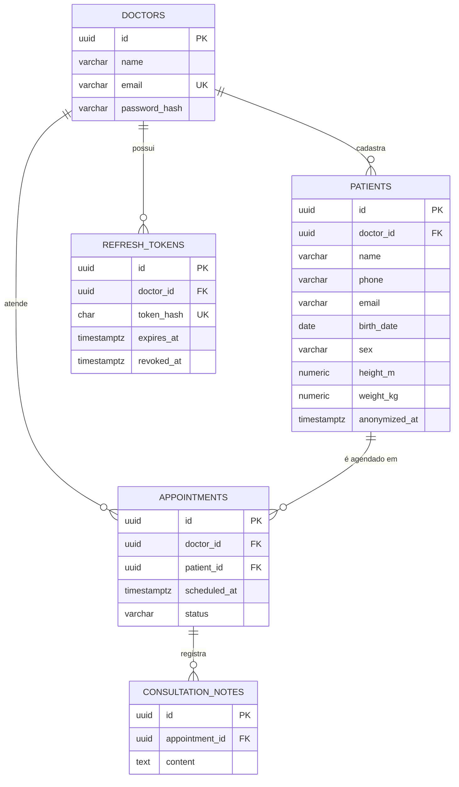

# PLANO DE IMPLEMENTAÇÃO — ProntoMed API

> **A bíblia de execução.** Quem ler este arquivo do zero implementa a POC inteira
> na ordem certa. Origem: desafio técnico "Desafio Backend" (Afya) — 4 páginas,
> texto + 6 wireframes, lido em 05/08/2026.
>
> **Fonte única:** produto, domínio, invariantes e ADRs moram em
> [PRODUCT.md](PRODUCT.md); débitos, em [DEBITOS-TECNICOS.md](DEBITOS-TECNICOS.md);
> regras de banco, em [contexto_agentes/review-database.md](contexto_agentes/review-database.md).
> Este plano **aplica e cita** — não redefine.

**Estado:** 📋 planejado — nenhuma linha de código escrita.
**Premissa arquitetural:** DDD (agregados + referência por identidade) sobre
arquitetura hexagonal, na **estrutura de pastas da referência técnica** (NestJS).
**Stack:** Node 22 · TypeScript 5 strict · **NestJS 10** · TypeORM · PostgreSQL 16 · Zod · Jest.
**Ambiente:** **desenvolvimento apenas** — não há build nem deploy de produção (ADR-12).

### Como usar este documento

| Se você quer… | Vá para |
| --- | --- |
| entender o que foi pedido | §1, §2, §3 |
| entender por que o código é assim | §4 (arquitetura), §5 (ADRs) |
| modelar o banco | §6, §7 |
| implementar auth | §8 |
| implementar uma rota | §9, §11 |
| começar a codar **agora** | **§13 — fases, na ordem** |
| saber o que o README precisa dizer | §15 |
| saber o que ficou de fora e por quê | §16 |

---

## Índice

**Parte I — O que construir**
1. [O desafio em uma página](#1) · 2. [O que os wireframes revelam](#2) · 3. [Escopo](#3)

**Parte II — Como pensar**
4. [Arquitetura: NestJS + hexagonal + DDD](#4) · 5. [Decisões (ADR)](#5)

**Parte III — O que modelar**
6. [Modelo de dados](#6) · 7. [Invariantes](#7) · 8. [Autenticação](#8) · 9. [API REST](#9)

**Parte IV — Como construir**
10. [Estrutura de pastas](#10) · 11. [Padrões de código](#11) · 12. [Qualidade: validação, consistência, idempotência](#12) · 13. [Fases de implementação](#13) · 14. [Ambiente dev e Swagger](#14) · 15. [Contrato do README](#15) · 16. [Governança e armadilhas](#16)

**Apêndices:** [A](#apA) dependências · [B](#apB) tsconfig · [C](#apC) eslint · [D](#apD) jest · [E](#apE) docker · [F](#apF) env

---

<a id="1"></a>

# Parte I — O que construir

## 1. O desafio em uma página

**Enunciado:** backend de prontuário eletrônico onde o médico cadastra informações
do paciente (nome, telefone, data de nascimento, sexo, altura, peso) e faz os
registros das consultas realizadas por paciente.

### 1.1 Requisitos funcionais

| ID | Requisito | Tipo | Fase |
| --- | --- | --- | --- |
| RF-01 | Cadastrar paciente: nome, telefone, email, nascimento, sexo, altura, peso | Obrigatório | F3 |
| RF-02 | Listar e editar o perfil dos pacientes | Obrigatório | F3 |
| RF-03 | Cadastrar agendamento de consulta para um paciente | Obrigatório | F4 |
| RF-04 | Listar, alterar e excluir agendamentos | Obrigatório | F4 |
| RF-05 | Anotar uma observação durante a consulta | Obrigatório | F5 |
| RF-06 | Visualizar as anotações das consultas dos pacientes | Obrigatório | F5 |
| RF-07 | Validar a agenda: não permitir dois pacientes na mesma hora | Desejável | F4 |
| RF-08 | Excluir dados pessoais do paciente (LGPD) **mantendo o histórico de consulta** | Desejável | F3 |

### 1.2 Requisitos não funcionais

| ID | Requisito | Tipo | Fase | Como é atendido |
| --- | --- | --- | --- | --- |
| RNF-01 | API REST (HTTP/JSON) | Obrigatório | F1 | NestJS, verbos e status semânticos |
| RNF-02 | Node.js (JS ou TS) | Obrigatório | F0 | TypeScript strict + NestJS 10 |
| RNF-03 | Documentação da API gerada | Obrigatório | F6 | `@nestjs/swagger` alimentado pelos **schemas Zod** (`nestjs-zod`) |
| RNF-04 | Dados validados na inserção/atualização | Obrigatório | F1–F5 | `ZodValidationPipe` global + invariantes no domínio + constraints |
| RNF-05 | Testes unitários e/ou de integração | Obrigatório | F2–F5 | Jest com `Test.createTestingModule` + Supertest |
| RNF-06 | Documentação da modelagem (ER) | Desejável | F7 | ER em Mermaid no README |
| RNF-07 | MySQL ou PostgreSQL, com ou sem ORM | Desejável | F2 | PostgreSQL 16 + TypeORM, migrations geradas e revisadas |
| RNF-08 | Setup com docker/docker-compose | Desejável | F0 | `docker compose up -d` sobe tudo |
| RNF-09 | Hospedar em cloud | Desejável | — | **fora de escopo** (ADR-12) |
| RNF-10 | Autenticação/autorização | Desejável | F2 | JWT + refresh opaco revogável, `JwtAuthGuard` global (§8) |
| RNF-11 | Lint / qualidade | Desejável | F0 | ESLint + Prettier + `tsc --noEmit` |
| RNF-12 | Pipeline automatizado | Desejável | F7 | GitHub Actions: lint → build → testes |

### 1.3 Critérios de avaliação (do próprio PDF)

Funcional · não funcional · **boas práticas (SOLID, code-smells)** · **estrutura e
organização (componentização, camadas)** · legibilidade · **testes que garantam os
requisitos** · documentação (**histórico de commits**, readme, diagramas).

> O histórico de commits **é entregável**. §13 traz os commits sugeridos por fase.

---

<a id="2"></a>

## 2. O que os wireframes revelam

Seis telas (PRONTOMED, menu `Pacientes` / `Agendamentos`): lista de pacientes ·
detalhe com tabela "Data da consulta × Atendimento" · modal "Anotações do
atendimento" · lista de agendamentos · modal "Novo agendamento" · modal "Detalhes
agendamento" com Salvar/Excluir.

| # | Conclusão |
| --- | --- |
| C1 | **A anotação pende do agendamento, não do paciente.** O campo "Data da Consulta" do modal é um *dropdown* com as datas já existentes: o médico escolhe **qual consulta** está anotando |
| C2 | **"Agendamento" e "consulta realizada" são a mesma linha com status** — `SCHEDULED → COMPLETED \| CANCELLED` |
| C3 | **"Excluir agendamento" = cancelar.** Delete físico destrói a trilha e colide com RF-08. O verbo continua `DELETE`; o efeito é `status = CANCELLED` |
| C4 | **O enunciado se contradiz:** o texto de abertura não cita email; o RF-01 cita. Decisão: **email entra**, opcional, validado quando presente |
| C5 | **O wireframe mostra só data; o RF-07 fala em "mesma hora".** Decisão: `scheduled_at` com hora |
| C6 | **Não há tela de login, mas a agenda é "a MINHA agenda".** RF-07 pressupõe um sujeito: por isso existe `doctors`, e `doctorId` escopa toda leitura e escrita (INV-04) |

---

<a id="3"></a>

## 3. Escopo

**Dentro:** RF-01..RF-08 · autenticação com refresh token · validação em três
camadas · testes unitários e de integração · Swagger navegável · ambiente Docker de
desenvolvimento · seed de demonstração · README para o avaliador.

**Fora, por decisão declarada:**

| Fora | Por quê |
| --- | --- |
| Build e deploy de produção, cloud | O contexto é um desafio avaliado localmente |
| Redis, filas, eventos de domínio, CQRS | Nenhum requisito pede; infra sem requisito é code-smell na avaliação |
| CASL, RBAC, multi-área | Uma persona só (DEBT-08) |
| Rotação de refresh, família de tokens, janela de graça | Responde a um "desejável" de uma linha com a parte mais frágil do projeto (ADR-11, DEBT-11) |
| Frontend | O desafio é de backend; os wireframes são guia de domínio |

### 3.1 O prisma: simplicidade

Isto é uma POC de desafio técnico, lida por um avaliador sênior com pouco tempo.
**O critério de toda decisão daqui em diante:** o avaliador entende em uma passada
de leitura?

Regra prática, nesta ordem:

1. **O enunciado pede?** Se não pede e não sustenta um item avaliado, fica fora.
2. **É o item obrigatório ou o desejável?** Obrigatório merece rigor; desejável merece a versão honesta e pequena.
3. **Quanto custa em superfície?** Uma tabela, uma dependência, um endpoint e um conceito novo têm preço — e o preço é cobrado na leitura de quem avalia.

**O que o prisma nunca corta:** o índice único parcial com o teste concorrente
(INV-01), a anonimização que preserva histórico (RF-08), o escopo por médico em
toda leitura (INV-04), a separação em camadas com portas e adapters, o Zod como
fonte única de validação e Swagger, e o teste que rastreia requisito. São os itens
que o próprio PDF diz que vai avaliar.

**O que o prisma já cortou:** rotação de refresh · `@nestjs/terminus` no
healthcheck · interceptor de logging com correlation-id · a rota redundante de
anotações. Cada corte tem linha no ledger ou nota no lugar onde a decisão se
aplica — corte silencioso vira buraco, corte declarado vira decisão.

---

<a id="4"></a>

# Parte II — Como pensar

## 4. Arquitetura: NestJS + hexagonal + DDD

A estrutura de pastas **espelha a referência técnica** — mesmas camadas, mesmos
nomes, mesmo mecanismo de injeção. Sobre ela, duas proteções que atuam em eixos
diferentes:

| Eixo | Quem protege | Regra concreta aqui |
| --- | --- | --- |
| **Fora do processo** (banco, HTTP, cripto) | **Hexagonal** | O domínio declara **portas** (interfaces em `domains/domain/repositories/`); a infra escreve **adapters**. O provider do Nest liga token → adapter |
| **Dentro do domínio** (fronteira entre conceitos) | **DDD (agregados)** | **Agregados se referenciam por ID**, e **uma transação toca um agregado** |

### 4.1 Camadas (espelho da referência técnica)

| Camada | Diretório | Responsabilidade |
| --- | --- | --- |
| **Domain** | `domains/domain/{model-entities,services,enums,repositories}` | Entidades TypeORM com comportamento, casos de uso, portas, `Either` |
| **Gateways** | `gateways/http/{controllers,schemas,pipes}` | Controllers, validação Zod, roteamento |
| **Framework** | `framework/{authentication,filters,interceptors}` | Guards, filtro global de exceções, JWT |
| **Infrastructure** | `infrastructure/databases/typeorm/postgres/{migrations,repositories,seeds}` | DataSource, migrations, adapters dos repositórios |
| **Presentation** | `presentation/presenters/` | Formatação das respostas |
| **Shared** | `shared/{constants,errors,environments}` | Tokens de DI, `Either`, env validado |

### 4.2 Injeção de dependência é do Nest

Nada de container manual. O padrão é **idêntico** ao da referência técnica
(`area.provider.ts` + token em `shared/constants/repositories.ts`):

```ts
// shared/constants/repositories.ts
export const PATIENTS_REPOSITORY = 'PATIENTS_REPOSITORY';

// domains/domain/services/patients/patients.provider.ts
export const PatientsProvider = [
  {
    provide: PATIENTS_REPOSITORY,
    useFactory: (ds: DataSource) => new TypeOrmPatientRepository(ds),
    inject: [PRONTOMED_POSTGRES_DATA_SOURCE],
  },
];
```

**A única divergência deliberada do espelho:** a factory entrega um **adapter que
implementa a porta**, não o `Repository<T>` cru do TypeORM. Mesmo mecanismo, mesmo
número de arquivos de provider — muda o que sai da fábrica. É isso que permite o
teste unitário rodar sem banco (`overrideProvider(PATIENTS_REPOSITORY)`) e o que
mantém o caso de uso livre de query builder.

### 4.3 Agregados

| Agregado | Raiz | Contém | Porta | Módulo Nest |
| --- | --- | --- | --- | --- |
| **Doctor** | `Doctor` | — | `DoctorRepository` | `AuthenticationModule` |
| **RefreshSession** | `RefreshToken` | — | `RefreshTokenRepository` | `AuthenticationModule` |
| **Patient** | `Patient` | — | `PatientRepository` | `PatientsModule` |
| **Appointment** | `Appointment` | `ConsultationNote[]` | `AppointmentRepository` | `AppointmentsModule` |

- **A anotação não tem repositório**: é entidade interna do agregado `Appointment` (C1). Um repositório por raiz, quatro no total.
- **Referência por ID**: `Appointment.patientId: string`. Relação TypeORM navegável entre agregados (`@ManyToOne(() => Patient)`) **não é declarada** — só a coluna e a FK. Isso impede o join entre agregados de nascer por descuido.
- **Transação = um agregado.** Operação multi-linha (consulta + suas anotações) é declarada **na porta** e a transação vive no adapter, nunca no caso de uso.

### 4.4 Fronteira entre módulos

Em Nest, a fronteira é o **módulo**, e ela é real: o que não está em `exports` não
é injetável fora.

- `AppointmentsModule` **importa** `PatientsModule` e injeta `FindPatientSummaryService`. Ele **nunca** injeta `PATIENTS_REPOSITORY` nem faz join com `patients`.
- Cada módulo de domínio exporta o mínimo: seus services públicos e seu provider.
- `HttpModule` concentra os controllers e importa os módulos de domínio — igual à referência técnica.

### 4.5 Regra de dependência

```
gateways/http ──▶ domains/domain/services ──▶ repositories (portas)
                                                      ▲
                                      infrastructure (adapters)
```

| Proibição | Severidade |
| --- | --- |
| `domains/domain/services/**` importa `typeorm`, `express` ou `@nestjs/typeorm` | **CRÍTICO** |
| `domains/domain/services/**` importa `infrastructure/**` | **CRÍTICO** |
| Controller acessa repositório sem passar pelo service | **ALTO** |
| Um módulo de domínio injeta o token de repositório de outro | **ALTO** |

> **Exceção declarada:** `domains/domain/model-entities/**` importa `typeorm` — as
> entidades **são** as entidades do ORM (ADR-03). O que não pode importar ORM é o
> **caso de uso**. É essa a linha que o lint protege.

---

<a id="5"></a>

## 5. Decisões (ADR)

> **Autoridade: [PRODUCT.md §adrs](PRODUCT.md).** As 13 ADRs — decisão, alternativa
> rejeitada e preço — moram lá. Este plano **aplica**; não redefine.

As mais citadas aqui: **ADR-01** (NestJS, DI do framework) · **ADR-02** (domínio
declara portas) · **ADR-03** (a entity é a do TypeORM, sem mapper) · **ADR-04**
(agregados por ID, transação por agregado) · **ADR-07** (Zod é a fonte da
validação **e** do Swagger) · **ADR-08** (migration gerada pelo TypeORM, revisada e
forward-only) · **ADR-09** (invariante crítica também no banco) · **ADR-10** (LGPD
por anonimização).

---

<a id="6"></a>

# Parte III — O que modelar

## 6. Modelo de dados

### 6.1 Diagrama ER



### 6.2 DDL de referência

Este é o **alvo**. O SQL sai do `migration:generate` a partir das entities e é
revisado contra esta especificação antes de comitar (§16.2).

```sql
CREATE TABLE doctors (
  id            uuid PRIMARY KEY DEFAULT gen_random_uuid(),
  name          varchar(150) NOT NULL,
  email         varchar(255) NOT NULL,
  password_hash varchar(255) NOT NULL,
  created_at    timestamptz  NOT NULL DEFAULT now(),
  updated_at    timestamptz  NOT NULL DEFAULT now(),
  CONSTRAINT uk_doctors_email UNIQUE (email)
);

CREATE TABLE refresh_tokens (
  id          uuid PRIMARY KEY DEFAULT gen_random_uuid(),
  doctor_id   uuid        NOT NULL REFERENCES doctors(id),
  token_hash  char(64)    NOT NULL,
  expires_at  timestamptz NOT NULL,
  revoked_at  timestamptz,
  created_at  timestamptz NOT NULL DEFAULT now(),
  CONSTRAINT uk_refresh_tokens_hash UNIQUE (token_hash)
);
CREATE INDEX idx_refresh_tokens_doctor ON refresh_tokens (doctor_id);

CREATE TABLE patients (
  id            uuid PRIMARY KEY DEFAULT gen_random_uuid(),
  doctor_id     uuid         NOT NULL REFERENCES doctors(id),
  name          varchar(150) NOT NULL,
  phone         varchar(20),
  email         varchar(255),
  birth_date    date,
  sex           varchar(20),
  height_m      numeric(3,2),
  weight_kg     numeric(5,2),
  anonymized_at timestamptz,
  created_at    timestamptz  NOT NULL DEFAULT now(),
  updated_at    timestamptz  NOT NULL DEFAULT now(),
  CONSTRAINT ck_patients_sex    CHECK (sex IS NULL OR sex IN ('MALE','FEMALE','OTHER','UNDISCLOSED')),
  CONSTRAINT ck_patients_height CHECK (height_m  IS NULL OR (height_m  > 0.30 AND height_m  < 2.60)),
  CONSTRAINT ck_patients_weight CHECK (weight_kg IS NULL OR (weight_kg > 0.50 AND weight_kg < 500))
);
CREATE INDEX idx_patients_doctor ON patients (doctor_id);

CREATE TABLE appointments (
  id           uuid PRIMARY KEY DEFAULT gen_random_uuid(),
  doctor_id    uuid        NOT NULL REFERENCES doctors(id),
  patient_id   uuid        NOT NULL REFERENCES patients(id),
  scheduled_at timestamptz NOT NULL,
  status       varchar(20) NOT NULL DEFAULT 'SCHEDULED',
  created_at   timestamptz NOT NULL DEFAULT now(),
  updated_at   timestamptz NOT NULL DEFAULT now(),
  CONSTRAINT ck_appointments_status CHECK (status IN ('SCHEDULED','COMPLETED','CANCELLED'))
);
-- INV-01: a agenda do médico não admite dois compromissos vivos no mesmo instante
CREATE UNIQUE INDEX uk_appointments_doctor_slot
  ON appointments (doctor_id, scheduled_at) WHERE status <> 'CANCELLED';
CREATE INDEX idx_appointments_patient ON appointments (patient_id, scheduled_at DESC);

CREATE TABLE consultation_notes (
  id             uuid PRIMARY KEY DEFAULT gen_random_uuid(),
  appointment_id uuid        NOT NULL REFERENCES appointments(id),
  content        text        NOT NULL,
  created_at     timestamptz NOT NULL DEFAULT now(),
  updated_at     timestamptz NOT NULL DEFAULT now()
);
CREATE INDEX idx_notes_appointment ON consultation_notes (appointment_id, created_at);
```

### 6.3 A entity manda no DDL — declare os nomes

Como a migration é **gerada a partir das entities**, tudo que não estiver
declarado no decorator vira nome aleatório (`UQ_a1b2c3…`). Portanto:

```ts
@Entity({ name: 'appointments' })
@Index('uk_appointments_doctor_slot', ['doctorId', 'scheduledAt'], {
  unique: true,
  where: `status <> 'CANCELLED'`,          // ← índice único PARCIAL (INV-01)
})
@Check('ck_appointments_status', `status IN ('SCHEDULED','COMPLETED','CANCELLED')`)
export class Appointment {
  @PrimaryGeneratedColumn('uuid', {
    name: 'id',
    primaryKeyConstraintName: 'pk_appointments',
  })
  id!: string;

  @Column({ name: 'patient_id', type: 'uuid' })
  patientId!: string;                       // ← ID, sem @ManyToOne (ADR-04)

  @Column({ name: 'scheduled_at', type: 'timestamptz' })
  scheduledAt!: Date;
}
```

**Checklist da entity antes de gerar migration:** nome de tabela · `primaryKeyConstraintName` ·
`@Index` nomeado (com `where` quando parcial) · `@Check` nomeado · `foreignKeyConstraintName`
nas FKs · `transformer` em toda coluna `numeric`.

### 6.4 Notas de modelagem

- **Altura em metros** (`1.68`) — casa com o wireframe. `numeric`, nunca `float`.
- ⚠️ **`numeric` volta do TypeORM como `string`.** Toda coluna `numeric` **exige** transformer, senão `heightM` é `"1.68"` na resposta:
  ```ts
  transformer: { to: (v: number | null) => v, from: (v: string | null) => (v === null ? null : Number(v)) }
  ```
- `timestamptz` para instante; `date` puro só em `birth_date`.
- `sex` e `status` como `varchar` + `@Check` — não `enum` nativo do Postgres.
- **Sem soft-delete genérico.** `patients.anonymized_at` (LGPD) e `appointments.status = CANCELLED` (agenda) — cada tabela diz o que "excluir" significa nela.
- `created_at` / `updated_at` por `@CreateDateColumn` / `@UpdateDateColumn`.

---

<a id="7"></a>

## 7. Invariantes

> **Autoridade: [PRODUCT.md §invariantes](PRODUCT.md).** As 7 leis do sistema — com
> enforcement e resposta HTTP — moram lá. Aqui elas são **citadas por ID**
> (INV-01 … INV-07) nas seções de modelagem, auth, qualidade e testes.

Matriz de cobertura de teste em §12.4; checagem em review, em
[review-domain.md §verifica](contexto_agentes/review-domain.md).

---

<a id="8"></a>

## 8. Autenticação

### 8.1 Os dois tokens

| Token | Formato | TTL | Onde vive |
| --- | --- | --- | --- |
| **Access** | JWT HS256 — `sub` (doctorId), `email`, `exp` | 15 min | header `Authorization: Bearer <jwt>` |
| **Refresh** | opaco — 32 bytes aleatórios em base64url | 8 horas | corpo da resposta |

**Por que o refresh é opaco:** JWT de refresh é auto-validável e, portanto,
irrevogável — o logout viraria teatro (o servidor diria "ok" e o token continuaria
valendo). Token opaco obriga uma consulta na tabela, e é essa consulta que faz o
logout ser real.

**Por que não há rotação** (ADR-11): o enunciado pede, como *desejável*,
"login/logout, token JWT". Rotação com família de tokens, detecção de reuso e
janela de graça responderia a isso com uma auto-FK, duas colunas a mais, uma
operação transacional na porta e os três testes mais frágeis da suíte. Fica
declarado em **DEBT-11**, com o gatilho que o torna inaceitável.

### 8.2 Fluxos

Três estados possíveis para um refresh, e nada além disso: **existe e vale** ·
**expirou** · **foi revogado**.

```
POST /api/auth/login { email, password }
  ├─ senha inválida ......................... 401 INVALID_CREDENTIALS
  └─ ok → grava SHA-256 do refresh (INV-06)
          200 { accessToken, refreshToken, expiresIn: 900 }

POST /api/auth/refresh { refreshToken }
  ├─ hash inexistente, expirado ou revogado . 401 INVALID_REFRESH_TOKEN
  └─ válido → emite novo access token; o refresh segue valendo até expirar
              200 { accessToken, expiresIn: 900 }

POST /api/auth/logout { refreshToken } → 204 (idempotente: revoga se achar, cala se não)
GET  /api/auth/me (Bearer)             → 200 { id, name, email }
```

**Consequência boa da simplificação:** sem rotação, `POST /auth/refresh` é
naturalmente idempotente — dois refresh concorrentes (duas abas, um retry) devolvem
dois access tokens válidos e ninguém perde a sessão. A janela de graça existia só
para consertar um problema que a rotação criava (§12.3).

### 8.3 A porta de sessão

Uma escrita por operação — nenhuma transação explícita, nenhum `queryRunner`:

```ts
export interface RefreshTokenRepository {
  create(token: RefreshToken): Promise<RefreshToken>;
  findValidByHash(hash: string): Promise<RefreshToken | null>;  // não expirado, não revogado
  revokeByHash(hash: string): Promise<void>;                    // logout
}
```

### 8.4 As duas portas de criptografia

O caso de uso precisa comparar senha e emitir token, mas não pode conhecer
`bcryptjs` nem `@nestjs/jwt` (Apêndice C). Duas abstrações em
`shared/interfaces/cryptography/` — que servem ao mesmo tempo de contrato e de
token de DI — e dois adapters em `framework/cryptography/`:

```ts
// shared/interfaces/cryptography/password-hasher.ts
export abstract class PasswordHasher {
  abstract hash(plain: string): Promise<string>;
  abstract compare(plain: string, hash: string): Promise<boolean>;
}

// shared/interfaces/cryptography/token-issuer.ts
export abstract class TokenIssuer {
  abstract issueAccessToken(payload: { sub: string; email: string }): Promise<string>;
  abstract generateRefreshToken(): string;          // 32 bytes aleatórios, base64url
  abstract hashRefreshToken(token: string): string; // SHA-256 hex (INV-06)
}
```

`BcryptPasswordHasher` e `JwtTokenIssuer` implementam as duas; o
`CryptographyModule` as exporta. **O ganho concreto é no teste:** o unitário injeta
um hasher falso e não paga os ~80 ms de bcrypt por caso.

### 8.5 Guard global, exceção explícita

Espelhando a referência técnica (`APP_GUARD` no `HttpModule`):

- `JwtAuthGuard` registrado como `APP_GUARD` — **toda rota nasce autenticada**.
- `@Public()` (decorator + `Reflector`) libera `login`, `refresh`, `health` e `docs`. Rota pública é decisão visível no código, não ausência de configuração.
- `@CurrentDoctor()` (param decorator) extrai `request.doctor.id`. **Nenhum service lê `request`** — o controller passa `doctorId` por parâmetro; INV-04 depende disso.
- Senha com **bcryptjs** (JS puro, sem `node-gyp`), custo 10 — atrás da porta `PasswordHasher` (§8.4).
- Env validado no boot pelo `ConfigModule.forRoot({ validate })` com Zod: faltou variável, o processo não sobe.

---

<a id="9"></a>

## 9. API REST

Prefixo global **`/api`** (`app.setGlobalPrefix('api')`, igual à referência técnica).
Tudo autenticado, exceto o que tem `@Public()`.

### 9.1 Endpoints

| Método | Rota | Descrição | OK | Erros |
| --- | --- | --- | --- | --- |
| `GET` | `/api/health` | liveness — o container respondeu | 200 | — |
| `POST` | `/api/auth/login` | autentica | 200 | 400, 401 |
| `POST` | `/api/auth/refresh` | novo access token | 200 | 400, 401 |
| `POST` | `/api/auth/logout` | revoga a sessão | 204 | 400 |
| `GET` | `/api/auth/me` | perfil autenticado | 200 | 401 |
| `POST` | `/api/patients` | RF-01 | 201 | 400, 401 |
| `GET` | `/api/patients` | RF-02 · `?search=&page=&perPage=` | 200 | 400, 401 |
| `GET` | `/api/patients/:id` | detalhe | 200 | 401, 404 |
| `PATCH` | `/api/patients/:id` | RF-02 | 200 | 400, 401, 404, 422 |
| `DELETE` | `/api/patients/:id` | **RF-08 anonimizar** | 204 | 401, 404 |
| `GET` | `/api/patients/:id/appointments` | RF-06 linha do tempo | 200 | 401, 404 |
| `POST` | `/api/appointments` | RF-03 | 201 | 400, 401, 404, 409, 422 |
| `GET` | `/api/appointments` | RF-04 · `?from=&to=&patientId=&status=` | 200 | 400, 401 |
| `GET` | `/api/appointments/:id` | detalhe | 200 | 401, 404 |
| `PATCH` | `/api/appointments/:id` | RF-04 reagendar / concluir | 200 | 400, 401, 404, 409, 422 |
| `DELETE` | `/api/appointments/:id` | RF-04 cancelar (C3) | 204 | 401, 404 |
| `POST` | `/api/appointments/:id/notes` | RF-05 | 201 | 400, 401, 404, 422 |

> **17 rotas, uma por requisito.** Não há `GET /appointments/:id/notes`: o detalhe
> do agendamento já devolve suas anotações, e a leitura que o RF-06 pede é a linha
> do tempo do paciente. Rota que duplica leitura é superfície a mais para o
> avaliador percorrer sem nada novo para ver.

### 9.2 Payloads

```jsonc
// POST /api/patients
{ "name": "Pedro Álvares", "phone": "(11) 99999-9999", "email": "pedro@example.com",
  "birthDate": "1987-01-01", "sex": "MALE", "heightM": 1.68, "weightKg": 75 }

// 201 (presenter)
{ "id": "uuid", "name": "Pedro Álvares", "phone": "(11) 99999-9999",
  "email": "pedro@example.com", "birthDate": "1987-01-01", "sex": "MALE",
  "heightM": 1.68, "weightKg": 75, "anonymized": false,
  "createdAt": "2026-08-05T18:00:00.000Z" }

// POST /api/appointments
{ "patientId": "uuid", "scheduledAt": "2026-08-12T14:00:00.000Z" }

// PATCH /api/appointments/:id — reagendar e/ou concluir
// Só SCHEDULED aceita mudança; COMPLETED e CANCELLED são terminais → 422.
// patientId não muda: cancele e agende de novo.
{ "scheduledAt": "2026-08-13T09:00:00.000Z", "status": "COMPLETED" }

// POST /api/appointments/:id/notes
{ "content": "O paciente apresentou uma vermelhidão na pele..." }

// GET /api/patients/:id/appointments — alimenta "Data da consulta × Atendimento"
{ "data": [ { "id": "uuid", "scheduledAt": "2019-01-01T09:00:00.000Z",
              "status": "COMPLETED",
              "notes": [ { "id": "uuid", "content": "…", "createdAt": "…" } ] } ] }
```

### 9.3 Envelope de listagem (único para toda a API)

```jsonc
{ "data": [ /* … */ ],
  "meta": { "page": 1, "perPage": 20, "total": 42, "totalPages": 3 } }
```

### 9.4 Catálogo de erros

Formato único, produzido pelo `AllExceptionsFilter`:

```jsonc
{ "statusCode": 409, "code": "SCHEDULE_CONFLICT",
  "message": "Já existe um agendamento neste horário.",
  "details": [ { "path": "scheduledAt", "message": "…" } ]   // só em 400
}
```

| `code` | Status | Quando |
| --- | --- | --- |
| `VALIDATION_ERROR` | 400 | Zod rejeitou (formato, tipo, campo desconhecido) |
| `INVALID_CREDENTIALS` | 401 | email ou senha incorretos |
| `UNAUTHENTICATED` | 401 | sem token, token inválido ou expirado |
| `INVALID_REFRESH_TOKEN` | 401 | refresh inexistente, expirado ou revogado |
| `RESOURCE_NOT_FOUND` | 404 | inexistente **ou de outro médico** (INV-04) |
| `SCHEDULE_CONFLICT` | 409 | horário ocupado (INV-01) |
| `BUSINESS_RULE_VIOLATION` | 422 | payload válido, regra violada (INV-02, INV-05) |
| `INTERNAL_ERROR` | 500 | inesperado — mensagem genérica, stack só no log |

> **O filtro nunca vaza nome de constraint.** `QueryFailedError` com `23505` em
> `uk_appointments_doctor_slot` vira 409 com mensagem humana — não
> "duplicate key value violates unique constraint".

---

<a id="10"></a>

# Parte IV — Como construir

## 10. Estrutura de pastas

Espelho da referência técnica — inclusive na **raiz**: o `docker-compose.yml` é
global, e o projeto NestJS mora em `api/` (o compose usa `context: ./api`).

```
prontomed-api/                     ← raiz do repositório
├─ docker-compose.yml              api + postgres · build context ./api (Apêndice E)
├─ CLAUDE.md · .gitignore
├─ .github/workflows/ci.yml        GitHub só lê .github/ da RAIZ → jobs com working-directory: api
└─ api/                            ← o projeto NestJS; cwd de todo `npm run`
   ├─ Dockerfile.dev · .dockerignore · .env.example · nest-cli.json
   ├─ package.json · package-lock.json · tsconfig.json · tsconfig.build.json
   ├─ eslint.config.mjs · .prettierrc
   ├─ README.md
   ├─ db/init-test-db.sh           cria $POSTGRES_DB_TEST no primeiro boot do container
   ├─ docs/                        PLAN.md · PRODUCT.md · DEBITOS-TECNICOS.md · DOC-STANDARDS.md · contexto_agentes/
   ├─ test/
   │  ├─ jest-e2e.json             config do e2e (Apêndice D)
   │  ├─ integration/              *.e2e-spec.ts (§12.4)
   │  └─ factories/                arranjo de caso reaproveitado
   └─ src/
      ├─ main.ts                   NestFactory · configureApp · setupSwagger · listen
      ├─ app.setup.ts              configureApp(): prefixo global + filtro — usado pelo main E pelos e2e
      ├─ swagger.setup.ts          setupSwagger(): patchNestJsSwagger · DocumentBuilder · /api/docs
      ├─ app.module.ts             ConfigModule(validate: Zod) · DatabaseModule · AuthModule · HttpModule + módulos de domínio
      │
      ├─ domains/domain/
      │  ├─ model-entities/        doctor · refresh-token · patient · appointment · consultation-note (+ index.ts p/ o DataSource)
      │  ├─ enums/                 sex.enum.ts · appointment-status.enum.ts
      │  ├─ repositories/          PORTAS: doctor · refresh-token · patient · appointment
      │  └─ services/
      │     ├─ authentication/     authenticate-doctor · refresh-session · revoke-session · get-profile
      │     │                      + authentication.module.ts + authentication.provider.ts
      │     ├─ patients/           register · list · get · update · anonymize · find-summary
      │     │                      + patients.module.ts + patients.provider.ts
      │     └─ appointments/       schedule · list · get · reschedule · cancel
      │                            add-note · list-notes · patient-timeline
      │                            + appointments.module.ts + appointments.provider.ts
      │
      ├─ gateways/http/
      │  ├─ http.module.ts         controllers + imports dos módulos de domínio + APP_GUARD/APP_PIPE
      │  ├─ controllers/core/      health.controller.ts
      │  ├─ controllers/domain/    authentication/ · patients/ · appointments/  (1 arquivo por ação + index.ts)
      │  ├─ schemas/domain/        *.schema.ts (Zod) + DTOs via createZodDto
      │  └─ pipes/                 zod-validation-pipe.ts
      │
      ├─ framework/
      │  ├─ authentication/        auth.module.ts · jwt-auth.guard.ts
      │  │                         decorators: public.decorator.ts · current-doctor.decorator.ts
      │  ├─ cryptography/          bcrypt-password-hasher.ts · jwt-token-issuer.ts
      │  │                         + cryptography.module.ts   (adapters das portas de §8.4)
      │  └─ filters/errors/        exception-filter.ts (AllExceptionsFilter)
      │
      ├─ infrastructure/databases/typeorm/postgres/
      │  ├─ typeorm-database.datasource.ts   (synchronize: false · migrationsTableName)
      │  ├─ database.module.ts · database.providers.ts   (@Global, igual à referência técnica)
      │  ├─ migrations/            <timestamp>-<escopo>.ts (geradas e revisadas)
      │  ├─ repositories/          adapters TypeORM que implementam as portas
      │  └─ seeds/                 demo.seed.ts
      │
      ├─ presentation/presenters/  patient · appointment · note · session
      │
      └─ shared/
         ├─ constants/             repositories.ts (tokens) · index.ts
         ├─ errors/                either.ts + types/ (domain-error com `code`)
         ├─ interfaces/cryptography/  password-hasher.ts · token-issuer.ts  (PORTAS de §8.4)
         └─ environments/          environment.ts (schema Zod) · environment.module.ts · environment.service.ts
```

**Todo caminho relativo deste plano parte de `api/`** — os scripts de §14.2
(`./src/infrastructure/...`), o `--config ./test/jest-e2e.json`, o `rootDir` do
Jest e o `include` do tsconfig. Único artefato fora de `api/`: o
`docker-compose.yml` e o workflow do CI.

**O barril `model-entities/index.ts` existe** porque o `DataSource` precisa da lista
de entidades — mesma razão da referência técnica. Ele **não** é porta de entrada para os
services: a fronteira aqui é o módulo Nest (o que não está em `exports` não é
injetável).

---

<a id="11"></a>

## 11. Padrões de código

Padrão-referência: todo código novo se parece com isto.

### 11.1 `Either` (`shared/errors/either.ts`)

```ts
export class Left<L, R> {
  constructor(readonly value: L) {}
  isLeft(): this is Left<L, R> { return true; }
  isRight(): this is Right<L, R> { return false; }
}
export class Right<L, R> {
  constructor(readonly value: R) {}
  isLeft(): this is Left<L, R> { return false; }
  isRight(): this is Right<L, R> { return true; }
}
export type Either<L, R> = Left<L, R> | Right<L, R>;
export const left  = <L, R>(v: L): Either<L, R> => new Left(v);
export const right = <L, R>(v: R): Either<L, R> => new Right(v);
```

### 11.2 Erro de domínio com `code` (`shared/errors/types/`)

```ts
export abstract class DomainError extends Error {
  abstract readonly code: string;
  constructor(message: string) { super(message); this.name = new.target.name; }
}
export class ScheduleConflictError      extends DomainError { readonly code = 'SCHEDULE_CONFLICT'; }
export class ResourceNotFoundError      extends DomainError { readonly code = 'RESOURCE_NOT_FOUND'; }
export class BusinessRuleViolationError extends DomainError { readonly code = 'BUSINESS_RULE_VIOLATION'; }
export class InvalidCredentialsError    extends DomainError { readonly code = 'INVALID_CREDENTIALS'; }
```

### 11.3 Entity com comportamento (`domains/domain/model-entities/appointment.entity.ts`)

A entity **é** a do TypeORM (ADR-03) — e mesmo assim guarda as próprias regras.
Referência ao paciente **por ID**, sem relação navegável (ADR-04):

```ts
@Entity({ name: 'appointments' })
@Index('uk_appointments_doctor_slot', ['doctorId', 'scheduledAt'], {
  unique: true, where: `status <> 'CANCELLED'`,
})
@Check('ck_appointments_status', `status IN ('SCHEDULED','COMPLETED','CANCELLED')`)
export class Appointment {
  @PrimaryGeneratedColumn('uuid', { name: 'id', primaryKeyConstraintName: 'pk_appointments' })
  id!: string;

  @Column({ name: 'doctor_id', type: 'uuid' })  doctorId!: string;
  @Column({ name: 'patient_id', type: 'uuid' }) patientId!: string;

  @Column({ name: 'scheduled_at', type: 'timestamptz' })
  scheduledAt!: Date;

  @Column({ name: 'status', type: 'varchar', length: 20, default: AppointmentStatus.SCHEDULED })
  status!: AppointmentStatus;

  @OneToMany(() => ConsultationNote, (n) => n.appointment, { cascade: ['insert'] })
  notes?: ConsultationNote[];              // ← DENTRO do agregado: relação permitida

  isActive(): boolean { return this.status !== AppointmentStatus.CANCELLED; }
  cancel(): void      { this.status = AppointmentStatus.CANCELLED; }
  complete(): void    { this.status = AppointmentStatus.COMPLETED; }
  rescheduleTo(d: Date): void { this.scheduledAt = d; }

  /** INV-05: a anotação só entra pela raiz do agregado, e só se a consulta está viva. */
  addNote(content: string): Either<BusinessRuleViolationError, ConsultationNote> {
    if (!this.isActive())
      return left(new BusinessRuleViolationError('Consulta cancelada não aceita anotações.'));
    const note = new ConsultationNote({ appointmentId: this.id, content });
    (this.notes ??= []).push(note);
    return right(note);
  }
}
```

> Relação navegável **dentro** do agregado (`Appointment → ConsultationNote`) é
> correta. Entre agregados (`Appointment → Patient`) é proibida: só a coluna
> `patient_id` e a FK no banco.

### 11.4 Porta (`domains/domain/repositories/appointment.repository.ts`)

```ts
export interface AppointmentRepository {
  create(appointment: Appointment): Promise<Appointment>;
  /** Persiste a raiz e suas anotações — o agregado inteiro, numa transação. */
  save(appointment: Appointment): Promise<Appointment>;
  findById(id: string, doctorId: string): Promise<Appointment | null>;
  /** INV-01: consulta viva do médico exatamente neste instante. */
  findActiveBySlot(doctorId: string, scheduledAt: Date): Promise<Appointment | null>;
  listByDoctor(doctorId: string, filters: AppointmentFilters, page: PageQuery): Promise<Paginated<Appointment>>;
  listByPatient(patientId: string, doctorId: string): Promise<Appointment[]>;
}
```

### 11.5 Caso de uso (`domains/domain/services/appointments/schedule-appointment.service.ts`)

Injeção pelo Nest, dependência tipada pela **porta**, e o dado de outro agregado vem
do **service público do outro módulo** — nunca do repositório dele:

```ts
@Injectable()
export class ScheduleAppointmentService {
  constructor(
    @Inject(APPOINTMENTS_REPOSITORY)
    private readonly appointments: AppointmentRepository,
    private readonly patients: FindPatientSummaryService,   // ← exportado por PatientsModule
  ) {}

  async execute(req: { doctorId: string; patientId: string; scheduledAt: Date }):
    Promise<Either<DomainError, { appointment: Appointment }>> {

    const patient = await this.patients.execute(req.patientId, req.doctorId);
    if (!patient) return left(new ResourceNotFoundError('Paciente não encontrado.'));

    if (patient.anonymized)                                                  // INV-02
      return left(new BusinessRuleViolationError(
        'Paciente anonimizado (LGPD) não pode receber novos agendamentos.'));

    const taken = await this.appointments.findActiveBySlot(req.doctorId, req.scheduledAt);
    if (taken)                                                               // INV-01
      return left(new ScheduleConflictError('Já existe um agendamento neste horário.'));

    const appointment = new Appointment({ ...req, status: AppointmentStatus.SCHEDULED });
    return right({ appointment: await this.appointments.create(appointment) });
  }
}
```

**Regras do service:** sem `Request`/`Response`, sem `typeorm`, sem `throw` para
erro esperado, um método público `execute`, dependências só por construtor.

### 11.6 Provider e módulo (espelho do `area.provider.ts`)

```ts
// domains/domain/services/appointments/appointments.provider.ts
export const AppointmentsProvider = [
  {
    provide: APPOINTMENTS_REPOSITORY,
    useFactory: (ds: DataSource) => new TypeOrmAppointmentRepository(ds),
    inject: [PRONTOMED_POSTGRES_DATA_SOURCE],
  },
];

// domains/domain/services/appointments/appointments.module.ts
@Module({
  imports: [PatientsModule],                       // ← fronteira: importa o módulo, não o token
  providers: [...AppointmentsProvider, ScheduleAppointmentService, /* … */],
  exports:   [...AppointmentsProvider, ScheduleAppointmentService, /* … */],
})
export class AppointmentsModule {}
```

### 11.7 Adapter (`infrastructure/.../repositories/typeorm-appointment.repository.ts`)

Aqui — e **só** aqui — existe TypeORM, query builder e transação:

```ts
export class TypeOrmAppointmentRepository implements AppointmentRepository {
  private readonly repo: Repository<Appointment>;
  constructor(private readonly dataSource: DataSource) {
    this.repo = dataSource.getRepository(Appointment);
  }

  async findById(id: string, doctorId: string): Promise<Appointment | null> {
    return this.repo.findOne({ where: { id, doctorId }, relations: { notes: true } });
    //                                       ↑ INV-04: escopo do médico em TODA leitura
  }

  async save(appointment: Appointment): Promise<Appointment> {
    return this.dataSource.transaction(async (m) => m.save(Appointment, appointment));
    //     ↑ o agregado inteiro numa transação; o caso de uso não sabe que ela existe
  }
}
```

### 11.8 Controller (`gateways/http/controllers/domain/appointments/schedule-appointment.controller.ts`)

```ts
@ApiTags('Agendamentos')
@Controller('appointments')
export class ScheduleAppointmentController {
  constructor(private readonly service: ScheduleAppointmentService) {}

  @Post()
  @ApiOperation({ summary: 'Agenda uma consulta para um paciente' })
  @ApiResponse({ status: 201, description: 'Agendamento criado' })
  @ApiResponse({ status: 409, description: 'Já existe agendamento neste horário' })
  async handle(
    @CurrentDoctor() doctorId: string,          // ← do token, nunca do body (INV-04)
    @Body() body: ScheduleAppointmentDto,       // ← createZodDto: valida e documenta
  ) {
    const result = await this.service.execute({
      doctorId, patientId: body.patientId, scheduledAt: new Date(body.scheduledAt),
    });

    if (result.isLeft()) throw result.value;     // AllExceptionsFilter traduz pelo `code`
    return AppointmentPresenter.toHTTP(result.value.appointment);
  }
}
```

### 11.9 Schema Zod + DTO (`gateways/http/schemas/domain/appointment.schema.ts`)

Uma fonte para validação **e** documentação (ADR-07):

```ts
export const scheduleAppointmentSchema = z.object({
  patientId: z.string().uuid(),
  scheduledAt: z.string().datetime({ offset: true }),
}).strict();                                     // campo desconhecido é erro, não silêncio

export class ScheduleAppointmentDto extends createZodDto(scheduleAppointmentSchema) {}
```

### 11.10 Bootstrap (`main.ts`) — espelho da referência técnica

```ts
async function bootstrap() {
  const app = await NestFactory.create(AppModule);
  app.setGlobalPrefix('api');
  app.useGlobalFilters(new AllExceptionsFilter());

  patchNestJsSwagger();                          // nestjs-zod alimenta o OpenAPI
  const config = new DocumentBuilder()
    .setTitle('ProntoMed API')
    .setDescription('Prontuário eletrônico — pacientes, agenda e anotações de consulta')
    .setVersion('1.0')
    .addBearerAuth()                             // ← botão Authorize no Swagger
    .build();
  SwaggerModule.setup('api/docs', app, SwaggerModule.createDocument(app, config));

  await app.listen(env.PORT);
}
```

---

<a id="12"></a>

## 12. Qualidade: validação, consistência, idempotência e testes

### 12.1 Validação em três camadas

| Camada | Pergunta que responde | Ferramenta | Falha vira |
| --- | --- | --- | --- |
| **Borda HTTP** | "o payload tem forma de payload?" | Zod via `ZodValidationPipe` **global** | 400 |
| **Domínio** | "essa operação é legítima agora?" | invariante na entity / no service | 422 / 409 |
| **Banco** | "e se dois pedidos chegarem juntos?" | constraint e índice único | 409 (de `23505`) |

O agendamento atravessa as três: Zod garante que `scheduledAt` é ISO válida; o
domínio garante que o paciente existe, não está anonimizado e o horário **parece**
livre; o índice parcial garante que **de fato** ficou livre no commit.

> O pipe é **global** (`APP_PIPE`), não por rota. No projeto de referência o
> `ZodValidationPipe` existe e é aplicado em 19% dos controllers — validação
> opcional é validação ausente.

### 12.2 Consistência

- **Transação = um agregado** (ADR-04). Nenhum service escreve em dois.
- **Transação nunca aparece no service.** A porta declara a operação atômica (`rotate()`, `save()` do agregado); o adapter usa `DataSource.transaction`.
- **O banco é a última linha, não a primeira.** Checagem em aplicação dá mensagem boa; constraint dá garantia. Os dois, sempre.
- **Leitura composta não é transacional** (linha do tempo faz duas consultas). Irrelevante com um escritor; fica declarado em vez de escondido.

### 12.3 Idempotência

| Operação | Idempotente? | Como |
| --- | --- | --- |
| `PATCH /patients/:id` | ✅ natural | mesmo payload → mesmo estado final |
| `DELETE /patients/:id` | ✅ | segunda chamada não muda nada e devolve 204 |
| `DELETE /appointments/:id` | ✅ | cancelar o cancelado → 204 |
| `POST /auth/logout` | ✅ | token desconhecido também devolve 204 |
| `POST /appointments` | ⚠️ efetiva | chave natural `(doctor_id, scheduled_at)` é única: retry vira 409 determinístico, nunca duplicata |
| `POST /auth/refresh` | ✅ | sem rotação, o refresh não muda de estado: duas chamadas devolvem dois access tokens válidos (§8.2) |

`Idempotency-Key` fica como ponto de extensão (DEBT-05).

### 12.4 Testes

| Camada | Ferramenta | Prova | Onde |
| --- | --- | --- | --- |
| **Unitário** | `Test.createTestingModule` + repositório in-memory via `overrideProvider(TOKEN)` | regra de negócio pura, sem banco | `*.spec.ts` ao lado do service |
| **Integração** | `Test.createTestingModule({imports:[AppModule]})` + Supertest + Postgres real | rota → service → banco, **incluindo constraints** | `test/integration/*.e2e-spec.ts` |

O repositório in-memory implementa **a mesma porta**. Consequência do ADR-02:
nenhum teste unitário mocka TypeORM — se precisar, há vazamento.

**Casos obrigatórios** (cada um rastreia requisito ou invariante):

| Teste | Prova | Camada |
| --- | --- | --- |
| agendar em horário livre → 201 | RF-03 | int. |
| mesmo instante, mesmo médico → **409** | RF-07 / INV-01 | unit + int |
| mesmo instante, **outro** médico → 201 | INV-01 | int. |
| cancelar libera o horário; reagendar para lá → 201 | INV-01 | int. |
| reagendar para horário ocupado → 409 | RF-04 / INV-01 | int. |
| reagendar ou concluir consulta cancelada → 422 | F4 §3 | unit |
| **duas requisições concorrentes no mesmo slot → exatamente um 201 e um 409** | ADR-09 | int. |
| anonimizar: PII nula + `anonymized_at` preenchido | RF-08 | unit + int |
| anonimizar **preserva** contagem de consultas e anotações | INV-03 | int. |
| anonimizado: novo agendamento → 422; edição → 422 | INV-02 | unit |
| recurso de outro médico → **404** (não 403) | INV-04 | int. |
| anotação em consulta inexistente → 404; em cancelada → 422 | INV-05 | unit |
| refresh válido → novo access token que abre rota protegida | §8.2 | int. |
| logout revoga; refresh posterior com o mesmo token → 401 | §8.2 | int. |
| logout duas vezes com o mesmo token → 204 nas duas | §12.3 | int. |
| refresh persistido só como hash — o valor cru não está na tabela | INV-06 | int. |
| nenhuma resposta contém `password_hash`/`token_hash` | INV-07 | int. |
| validação: altura 0, peso negativo, nascimento futuro, email inválido, sexo fora do enum, campo desconhecido → 400 com `details` | RNF-04 | int. |

> No teste de concorrência: pool com ≥2 conexões e asserção sobre o **conjunto**
> (`[201, 409]` em qualquer ordem), nunca sobre a ordem.

**Sem meta percentual de cobertura.** A lista acima é o gate; percentual produz
teste escrito para o contador.

---

<a id="13"></a>

## 13. Fases de implementação

Ordem por dependência real. Cada fase termina verde
(`npm run lint && npm run build && npm test`) e entrega um módulo de ponta a ponta.

---

### F0 — Fundação

**Entrega:** o projeto sobe com um comando e responde `/api/health`.

1. `nest new` (ou scaffold manual), `tsconfig` strict com `paths` `@/*` → `src/*`.
   `npm install` no host e **`package-lock.json` comitado** — sem lock, o `npm ci` do
   `Dockerfile.dev` aborta e a fase não tem como fechar.
2. ESLint (flat config) + Prettier **com a regra de fronteira** (Apêndice C).
3. Jest configurado (Apêndice D).
4. `docker-compose.yml` + `Dockerfile.dev` (Apêndice E): api + Postgres 16 (um container, dois bancos).
5. `shared/environments/`: schema Zod + `EnvironmentModule`/`Service`; `ConfigModule.forRoot({ validate })`.
6. `main.ts` com `setGlobalPrefix('api')`; `HealthController` devolvendo `{ status: 'ok' }`.

> **Sem `@nestjs/terminus`.** Uma dependência a mais para um endpoint de 5 linhas.
> Sondar o banco daqui exigiria injetar o `DataSource` num controller — exatamente
> a dependência que o Apêndice C proíbe. Se o banco cair, `migration:run` e
> qualquer rota autenticada denunciam na hora.

**Pronto quando:** `cp api/.env.example api/.env`, `docker compose up -d` e
`curl localhost:3333/api/health` → `{"status":"ok"}`.
**Commits:** `chore: bootstrap do projeto nestjs` · `chore: eslint com regra de fronteira de camadas` · `chore: ambiente docker com postgres 16` · `feat: healthcheck da api`

> O commit de health **não** diz "com verificação de banco": a nota acima proíbe
> sondar o banco daqui. Contradição do próprio plano, corrigida na fricção PRÉ de
> [sprint-01.01](desenvolvimento/sprints/sprint-01.01-fundacao.md) §issues.

---

### F1 — Kernel da plataforma

**Entrega:** o esqueleto que todos os módulos usam. Sem regra de negócio.

1. `shared/errors/either.ts` + `DomainError` com `code` + tipos.
2. `framework/filters/errors/exception-filter.ts`: `DomainError` → status pelo catálogo (§9.4); `ZodError` → 400 com `details`; `QueryFailedError 23505` → 409 humano; resto → 500 genérico com log.
3. `gateways/http/pipes/zod-validation-pipe.ts` + registro **global** (`APP_PIPE`).
4. `infrastructure/.../typeorm-database.datasource.ts` (`synchronize: false`, `migrationsTableName: 'typeorm_migrations'`) + `database.providers.ts` + `DatabaseModule` (`@Global`).
5. `HttpModule` inicial + `AppModule` montado.

**Pronto quando:** rota inexistente devolve o envelope padrão; erro forçado devolve 500 sem stack.
**Commits:** `feat: either e erros de dominio com code` · `feat: filtro global de excecoes` · `feat: pipe global de validacao zod` · `feat: data source e modulo de banco`

---

### F2 — `authentication` (RNF-10)

**Entrega:** login funcionando e rotas protegidas. Antes das features porque todas dependem de `@CurrentDoctor()`.

1. Entities `Doctor` e `RefreshToken` (com nomes de constraint declarados — §6.3).
2. **Migration gerada** (`npm run migration:generate --name=authentication`), revisada contra §6.2 e comitada.
3. Portas `PasswordHasher` / `TokenIssuer` (§8.4) + adapters em `framework/cryptography/` + `CryptographyModule`.
4. Portas `DoctorRepository` / `RefreshTokenRepository` (§8.3) + adapters + provider.
5. Services: `AuthenticateDoctorService`, `RefreshSessionService`, `RevokeSessionService`, `GetProfileService` — um `execute`, nenhuma transação.
6. `framework/authentication/`: `JwtAuthGuard` como `APP_GUARD`, `@Public()`, `@CurrentDoctor()`.
7. Controllers `/api/auth/{login,refresh,logout,me}` + `SessionPresenter`.
8. Testes: bloco de auth de §12.4.

**Pronto quando:** login devolve o par; rota protegida sem token → 401; logout revoga e o refresh seguinte responde 401.
**Commits:** `feat: entidades de medico e sessao` · `feat: migration de autenticacao` · `feat: portas de hash de senha e emissao de token` · `feat: login com access e refresh token` · `feat: logout revogando a sessao` · `feat: guard global de autenticacao` · `test: integracao dos fluxos de autenticacao`

---

### F3 — `patients` (RF-01, RF-02, RF-08)

1. Entity `Patient` (com `transformer` nas colunas `numeric` — §6.4) + migration gerada e revisada.
2. Porta + adapter (**toda leitura filtra `doctorId`**) + provider + `PatientsModule`.
3. Services: `RegisterPatient`, `ListPatients` (busca + paginação), `GetPatient`, `UpdatePatient`, `AnonymizePatient`, `FindPatientSummary` (o público, consumido por `AppointmentsModule`).
4. Schemas Zod `.strict()` + DTOs, controllers, `PatientPresenter`.
5. Testes: CRUD, validações, anonimização preservando histórico, 404 cross-doctor.

**Pronto quando:** o CRUD roda inteiro e a anonimização apaga PII sem perder nada da agenda.
**Commits:** `feat: entidade e cadastro de paciente` · `feat: listagem paginada com busca por nome` · `feat: edicao de perfil do paciente` · `feat: anonimizacao lgpd preservando historico` · `test: integracao de pacientes`

---

### F4 — `appointments`: agenda (RF-03, RF-04, RF-07)

1. Entity `Appointment` com `@Index` **parcial** e `@Check` nomeados (§6.3) + migration gerada; **conferir no SQL** que o `WHERE status <> 'CANCELLED'` saiu.
2. Porta + adapter + provider + `AppointmentsModule` (importando `PatientsModule`).
3. **Máquina de estados na entity:** `SCHEDULED` é o único estado mutável; `COMPLETED` e `CANCELLED` são terminais. `rescheduleTo()` e `complete()` devolvem `Left(BusinessRuleViolationError)` a partir de estado terminal; `cancel()` sobre já cancelado é no-op (204, idempotente — §12.3). São três guardas na entity, não uma invariante nova.
4. Services: `ScheduleAppointment`, `ListAppointments`, `GetAppointment`, `RescheduleAppointment`, `CancelAppointment`.
4. Controllers + `AppointmentPresenter`; filtro traduz `23505` → 409 `SCHEDULE_CONFLICT`.
5. Testes: todos os casos de agenda, **incluindo o concorrente**.

**Pronto quando:** duas requisições simultâneas no mesmo slot resultam em exatamente um 201 e um 409.
**Commits:** `feat: entidade de agendamento com indice unico parcial` · `feat: agendamento com validacao de conflito` · `feat: listagem com filtros de periodo e paciente` · `feat: reagendamento e cancelamento` · `test: integracao da regra de conflito de agenda`

---

### F5 — `appointments`: anotações (RF-05, RF-06)

1. Entity `ConsultationNote` (interna ao agregado) + migration; `Appointment.addNote()` (§11.3).
2. Services: `AddConsultationNote`, `ListNotesByAppointment`, `GetPatientTimeline`.
3. Persistência do agregado inteiro (raiz + anotações) em uma transação no adapter.
4. Controllers: `POST/GET /api/appointments/:id/notes` e `GET /api/patients/:id/appointments` — a tabela "Data da consulta × Atendimento" e o dropdown do modal num payload só.
5. Cuidado com N+1: a linha do tempo carrega as anotações em **uma** consulta (`relations`), não uma por consulta.
6. Testes: anotação em consulta cancelada → 422; timeline ordenada.

**Pronto quando:** a linha do tempo devolve as consultas do paciente com suas anotações, em uma chamada.
**Commits:** `feat: anotacoes como entidade do agregado consulta` · `feat: linha do tempo de consultas do paciente` · `test: integracao de anotacoes`

---

### F6 — Swagger e seed (RNF-03)

1. ~~`patchNestJsSwagger()` + `DocumentBuilder` com `addBearerAuth()`; `/api/docs`.~~
   **Antecipado para a sprint 01.03** ([sprint-01.03](desenvolvimento/sprints/sprint-01.03-openapi.md)):
   sem o documento montado, F2–F5 escreveriam `@ApiOperation` que ninguém veria — e
   `review-backend.md §verifica` já cobra essas anotações em toda rota nova. Com a
   infra em pé desde F1, cada fase nasce navegável e o item 2 abaixo passa a
   acompanhar cada endpoint, em vez de se acumular aqui.
2. `@ApiTags` por módulo (`Auth`, `Pacientes`, `Agendamentos`), `@ApiOperation` e `@ApiResponse` com **exemplos**, inclusive dos erros interessantes (409, 422) — escritos junto de cada rota, revisados aqui.
3. Seed espelhando os wireframes: médico demo, pacientes Pedro/Eduardo/Bruno, consultas em 01/01, 10/02 e 15/05 com anotações.

**Pronto quando:** dá para logar, clicar em **Authorize**, colar o token e executar **todos** os endpoints direto do `/api/docs`.
**Commits:** `feat: openapi a partir dos schemas zod` · `feat: swagger com autenticacao bearer` · `chore: seed de demonstracao`

---

### F7 — Documentação e pipeline

1. `README.md` completo conforme §15.
2. ER (Mermaid) e ADRs resumidos no README.
3. GitHub Actions: lint → build → testes (service `postgres:16-alpine`).
4. Varredura: nenhum `TODO`, nenhum `console.log`, nenhum segredo comitado, `git log` legível.

**Pronto quando:** clone limpo → `docker compose up -d` → `npm run migration:run && npm run seed` → `/api/docs` executa todos os fluxos.
**Commits:** `docs: readme com instrucoes, er e decisoes` · `ci: pipeline de lint, build e testes`

---

<a id="14"></a>

## 14. Ambiente dev e Swagger

### 14.1 Containers

| Serviço | Container | Porta | Notas |
| --- | --- | --- | --- |
| api | `api-prontomed` | 3333 | `nest start --watch`, volume montado |
| database | `db-prontomed` | **5433** no host (5432 na rede) | `postgres:16-alpine`; o init cria `prontomed` e `prontomed_test` |

> **A porta do host é 5433, não 5432.** O `POSTGRES_PORT` do `.env` é a porta vista
> **de fora** — o compose sobrescreve para 5432 dentro da rede. Com 5432 no `.env`,
> um `migration:run` disparado do host acerta o Postgres de **outro** projeto que
> ocupe a porta. Não é preferência estética: é um footgun destrutivo.

> **`nest start --watch` sem `-b swc`.** O modo swc do projeto de referência
> recompila mas **não reinicia o processo**, exigindo `docker restart` a cada
> mudança. Numa POC, previsibilidade vale mais que 200 ms de build.

### 14.2 Scripts (espelho da referência técnica)

```jsonc
{
  "build":             "nest build",
  "start":             "nest start",
  "start:dev":         "nest start --watch",
  "typecheck":         "tsc --noEmit",
  "lint":              "eslint \"{src,test}/**/*.ts\" --fix",
  "test":              "jest --passWithNoTests",
  "test:cov":          "jest --coverage",
  "test:e2e":          "NODE_ENV=test jest --config ./test/jest-e2e.json --runInBand",
  "migration:create":  "typeorm-ts-node-commonjs migration:create ./src/infrastructure/databases/typeorm/postgres/migrations/$npm_config_name",
  "migration:generate":"typeorm-ts-node-commonjs migration:generate ./src/infrastructure/databases/typeorm/postgres/migrations/$npm_config_name -d ./src/infrastructure/databases/typeorm/postgres/typeorm-database.datasource.ts",
  "migration:run":     "typeorm-ts-node-commonjs migration:run -d ./src/infrastructure/databases/typeorm/postgres/typeorm-database.datasource.ts",
  "migration:revert":  "typeorm-ts-node-commonjs migration:revert -d ./src/infrastructure/databases/typeorm/postgres/typeorm-database.datasource.ts",
  "seed":              "ts-node -r tsconfig-paths/register src/infrastructure/databases/typeorm/postgres/seeds/demo.seed.ts"
}
```

> **Nunca** `npx typeorm` direto — sempre `typeorm-ts-node-commonjs` pelos scripts.

> **`--passWithNoTests` em `test`.** F0 fecha sem nenhum `*.spec.ts` sob `src/`
> (o único teste da fase é o e2e, que roda por `test:e2e`), e `jest` sem suíte sai
> com código 1. Sem a flag, o gate "tudo verde" de F0 é inalcançável. A flag é
> inerte a partir de F1, quando existem specs de domínio.

### 14.3 Swagger é a ferramenta de avaliação

Não é enfeite: é como a API será exercitada.

- `/api/docs` aberto, sem autenticação para abrir.
- **Authorize** com `bearerAuth`: cola-se o `accessToken` e todas as rotas passam a funcionar.
- Tags por módulo, rotas na ordem de uso (login → pacientes → agendamentos → anotações).
- Toda rota com exemplo de request **e** response, inclusive dos erros interessantes (409, 422).
- Enums e formatos visíveis (`sex`, `status`, `date-time`) — vindos do Zod pelo `nestjs-zod`, sem duplicação manual.

---

<a id="15"></a>

## 15. Contrato do README

README é para **humano** — e o humano é o avaliador com pouco tempo. Na ordem de
quem acabou de clonar:

1. **O que é** — três linhas.
2. **Subir em 3 comandos** — `docker compose up -d`, `npm run migration:run`, `npm run seed`, com o que esperar de cada um.
3. **Credenciais do seed** — email e senha do médico demo, em destaque.
4. **Roteiro de avaliação em 6 passos** — abrir `/api/docs` → `POST /api/auth/login` → copiar `accessToken` → **Authorize** → criar paciente → agendar → **agendar de novo no mesmo horário e ver o 409** → anotar → ver a linha do tempo.
5. **Requisitos atendidos** — tabela RF/RNF × onde está, e o que ficou de fora com o porquê.
6. **Como rodar os testes** — unit, e2e, e o que cada suíte prova.
7. **Arquitetura em um diagrama e cinco linhas** — camadas, agregados, DI do Nest; link para `docs/PLAN.md`.
8. **Modelagem** — ER em Mermaid.
9. **Decisões e limites** — ADRs resumidos e os débitos, para deixar claro o que foi escolha.

O que o README **não** faz: repetir este plano, explicar DDD, ou pedir desculpa.

---

<a id="16"></a>

## 16. Governança e armadilhas

### 16.1 Convenções

| Item | Regra |
| --- | --- |
| Idioma | Código, arquivos e banco em **inglês**; mensagens ao usuário em **PT-BR** |
| Arquivos | `kebab-case` com sufixo de papel: `schedule-appointment.service.ts`, `patient.entity.ts`, `patients.provider.ts` |
| Classes | `PascalCase`; service termina em `Service`, controller em `Controller`; porta sem prefixo `I` |
| Banco | `snake_case`, tabela no plural, constraints `pk_` `fk_` `uk_` `idx_` `ck_` |
| Service | verbo infinitivo em inglês, um método público `execute` |
| Módulo Nest | um por contexto de domínio, com `*.module.ts` + `*.provider.ts` ao lado dos services |
| Teste | `*.spec.ts` ao lado do service; e2e em `test/integration/` |

### 16.2 Migrations — gerado pela ferramenta, controlado por humano

1. A entity declara **tudo** (nome de tabela, `primaryKeyConstraintName`, `@Index` nomeado com `where`, `@Check`, `foreignKeyConstraintName`) — §6.3.
2. `npm run migration:generate --name=<escopo>` produz o SQL.
3. **Revisão obrigatória** do arquivo gerado contra o DDL de §6.2 antes de comitar: nome de constraint, `WHERE` do índice parcial, tipo de coluna, `down()` coerente.
4. `npm run migration:run` aplica. **Nunca** `synchronize: true`; **nunca** `migrationsRun: true` no boot.
5. **Forward-only:** migration aplicada nunca é editada — a correção é uma migration nova.
6. Uma linha do tempo global em `infrastructure/.../migrations`.

### 16.3 Débitos técnicos

> **Autoridade: [DEBITOS-TECNICOS.md §abertos](DEBITOS-TECNICOS.md).** 11 débitos
> abertos (DEBT-01 … DEBT-11), cada um com severidade, razão e **gatilho de
> reabertura**. Nada é registrado aqui — débito duplicado é drift garantido.

Os dois ALTOS: **DEBT-01** (apagar o paciente não apaga o que o médico escreveu
sobre ele) e **DEBT-07** (nada impede tentar milhares de senhas no login).

### 16.4 Armadilhas conhecidas (leia antes de codar)

- **`zod` fica em `^3.23`** e `nestjs-zod` na major compatível. O `zod-to-openapi` que o `nestjs-zod` usa não acompanha o Zod 4 — subir a major quebra a geração do Swagger.
- **`numeric` volta como string** do TypeORM: sem `transformer`, `heightM` é `"1.68"` (§6.4).
- **`migration:generate` inventa nomes** de constraint quando a entity não os declara (`UQ_a1b2c3…`). Declare na entity (§6.3).
- **Índice parcial só sai se a entity tiver `where`** no `@Index`. Confira o SQL gerado — sem ele, INV-01 fica sem a garantia do banco.
- **`.strict()` nos schemas Zod**, senão campo desconhecido passa em silêncio.
- **`nest start --watch` sem swc** (§14.1).
- **Teste concorrente** exige pool com ≥2 conexões e asserção sobre conjunto, não ordem.
- **`emitDecoratorMetadata` + `experimentalDecorators`** ligados no `tsconfig`, senão a DI do Nest e o TypeORM não resolvem tipos.

---

<a id="apendices"></a>

# Apêndices

<a id="apA"></a>

### A — Dependências

```bash
# runtime
npm i @nestjs/common @nestjs/core @nestjs/platform-express @nestjs/config \
      @nestjs/swagger @nestjs/jwt \
      typeorm pg reflect-metadata rxjs \
      zod@^3.23 nestjs-zod bcryptjs class-transformer

# desenvolvimento
npm i -D @nestjs/cli @nestjs/schematics @nestjs/testing \
      typescript ts-node ts-jest tsconfig-paths \
      @types/node @types/jest @types/supertest @types/bcryptjs \
      jest supertest \
      eslint typescript-eslint \
      prettier eslint-config-prettier
```

> **`typescript-eslint` (pacote unificado, v8)** no lugar do par
> `@typescript-eslint/parser` + `@typescript-eslint/eslint-plugin`: é o formato que
> o flat config do Apêndice C consome (`tseslint.config(...)`).

<a id="apB"></a>

### B — `tsconfig.json`

```jsonc
{
  "compilerOptions": {
    "module": "commonjs", "target": "ES2022", "lib": ["ES2022"],
    "outDir": "./dist", "baseUrl": "./",
    "paths": { "@/*": ["src/*"] },
    "strict": true, "strictNullChecks": true, "noImplicitAny": true,
    "noUnusedLocals": true, "noUnusedParameters": true,
    "experimentalDecorators": true, "emitDecoratorMetadata": true,
    "esModuleInterop": true, "skipLibCheck": true,
    "forceConsistentCasingInFileNames": true, "sourceMap": true, "incremental": true
  },
  "include": ["src/**/*", "test/**/*"],
  "exclude": ["node_modules", "dist"]
}
```

<a id="apC"></a>

### C — ESLint: a arquitetura como regra

**Flat config (`api/eslint.config.mjs`), não `.eslintrc.json`.** O ESLint 9 só lê
flat config; um `.eslintrc.json` faz `npm run lint` morrer com *"Could not find
config file"* — e a regra de fronteira, que é o entregável real de F0, nunca roda.

```js
// api/eslint.config.mjs
import tseslint from 'typescript-eslint';
import prettier from 'eslint-config-prettier';

const FORBIDDEN_IN_SERVICES = [
  {
    group: ['typeorm', '@nestjs/typeorm', 'express', 'pg',
            'bcryptjs', '@nestjs/jwt', 'jsonwebtoken', 'crypto', 'node:crypto'],
    message: 'Caso de uso não depende de ORM, transporte nem cripto concreta — use a porta (ADR-02, §8.4).',
  },
  {
    group: ['**/infrastructure/**', '**/gateways/**'],
    message: 'A dependência aponta para dentro: o service não conhece infra nem transporte.',
  },
];

export default tseslint.config(
  { ignores: ['dist/**', 'coverage/**', 'node_modules/**'] },
  ...tseslint.configs.recommended,
  prettier,
  {
    files: ['src/domains/domain/services/**/*.ts'],
    rules: {
      'no-restricted-imports': 'off',
      '@typescript-eslint/no-restricted-imports': ['error', { patterns: FORBIDDEN_IN_SERVICES }],
    },
  },
  {
    files: ['src/gateways/http/controllers/**/*.ts'],
    rules: {
      'no-restricted-imports': 'off',
      '@typescript-eslint/no-restricted-imports': ['error', { patterns: [
        { group: ['typeorm', '**/infrastructure/**'],
          message: 'Controller fala com service, nunca com repositório ou ORM.' },
      ]}],
    },
  },
);
```

> **`@typescript-eslint/no-restricted-imports`, não a regra base.** A base ignora
> `import type { Repository } from 'typeorm'` — a versão do plugin pega. Proteção
> que não pega é pior que ausência.

> `model-entities/**` **pode** importar `typeorm` — a entity é a do ORM (ADR-03).
> O bloco casa por glob e é inerte enquanto a pasta não existe: instalar em F0 custa zero.

<a id="apD"></a>

### D — Jest

```jsonc
// package.json → "jest"
{
  "moduleFileExtensions": ["js", "json", "ts"],
  "rootDir": ".",
  "roots": ["<rootDir>/src"],          // ← sem isto, o jest varre api/docs/referencia_tecnica
  "testRegex": ".*\\.spec\\.ts$",
  "transform": { "^.+\\.(t|j)s$": "ts-jest" },
  "moduleNameMapper": { "^@/(.*)$": "<rootDir>/src/$1" },
  "collectCoverageFrom": ["src/domains/domain/**/*.ts"],
  "testEnvironment": "node"
}
```

```jsonc
// test/jest-e2e.json
{
  "moduleFileExtensions": ["js", "json", "ts"],
  "rootDir": "..",
  "roots": ["<rootDir>/test"],         // ← idem: `rootDir: ".."` alcança docs/
  "testRegex": ".e2e-spec.ts$",
  "transform": { "^.+\\.(t|j)s$": "ts-jest" },
  "moduleNameMapper": { "^@/(.*)$": "<rootDir>/src/$1" },
  "testEnvironment": "node"
}
```

<a id="apE"></a>

### E — Docker

O compose vive na **raiz** e aponta para `api/` — espelho da referência técnica (§10).

```yaml
# docker-compose.yml  ← RAIZ do repositório
services:
  api:
    image: api-prontomed
    container_name: api-prontomed
    build: { context: ./api, dockerfile: Dockerfile.dev }
    env_file: [./api/.env]
    environment:
      - POSTGRES_HOST=database
      - POSTGRES_PORT=5432        # o .env carrega a porta do HOST (5433)
    volumes: ["./api:/usr/src/app", "/usr/src/app/node_modules"]
    ports: ["3333:3333"]
    depends_on:
      database: { condition: service_healthy }
    networks: [prontomed-net]

  database:
    image: postgres:16-alpine
    container_name: db-prontomed
    env_file: [./api/.env]          # fonte única: POSTGRES_USER/PASSWORD/DB vêm daqui
    ports: ["5433:5432"]            # 5432 do host costuma estar ocupada por outro projeto
    volumes:
      - pgdata:/var/lib/postgresql/data
      - ./api/db/init-test-db.sh:/docker-entrypoint-initdb.d/init-test-db.sh
    healthcheck:
      test: ["CMD-SHELL", "pg_isready -U $$POSTGRES_USER -d $$POSTGRES_DB"]
      interval: 5s
      timeout: 5s
      retries: 10
    networks: [prontomed-net]

networks:
  prontomed-net:
    driver: bridge

volumes:
  pgdata:
```

```sql
#!/bin/sh
# api/db/init-test-db.sh   (executável; o entrypoint do Postgres roda .sh e .sql)
set -e

psql -v ON_ERROR_STOP=1 \
  -U "$POSTGRES_USER" -d "$POSTGRES_DB" \
  -c "CREATE DATABASE \"$POSTGRES_DB_TEST\" OWNER \"$POSTGRES_USER\";"
```

> **`.sh` e não `.sql`** para o nome do banco de teste ter um dono só: o
> `POSTGRES_DB_TEST` do `.env`, que é o mesmo valor que o `DataSource` de teste vai
> ler a partir de F1. Um literal no SQL divergiria em silêncio no dia em que a
> variável mudasse — e o sintoma seria "banco de teste não existe", longe da causa.

```dockerfile
# api/Dockerfile.dev
FROM node:22-alpine
WORKDIR /usr/src/app
COPY package*.json ./
RUN npm ci
COPY . .
RUN chown -R node:node /usr/src/app    # ver nota abaixo
USER node
EXPOSE 3333
CMD ["npm", "run", "start:dev"]
```

> **`USER node` não é higiene opcional.** O container escreve `dist/` no bind mount.
> Como root, o artefato aterrissa no host com dono root: o `npm run build` do host
> passa a falhar com `EACCES` e nem `rm -rf dist` resolve sem docker ou sudo. O
> usuário `node` da imagem é uid 1000, o mesmo do host.
>
> **Não** resolva isso com volume anônimo em `/usr/src/app/dist`: o `deleteOutDir:
> true` do `nest-cli.json` faria `rmdir` num ponto de montagem e o boot morre com
> `EBUSY`. O volume anônimo é só para `node_modules`.

**Pré-condição do primeiro `up`, a partir de um clone:**

```bash
cp api/.env.example api/.env      # o compose lê ./api/.env; ele é gitignorado
docker compose up -d
```

> `npm ci` **exige** `package-lock.json` — mas ele é **comitado**, então o clone já o
> traz e o `npm install` no host deixou de ser pré-condição. Quem clona precisa de
> Docker e nada mais; `lint`, `typecheck` e `test` rodam por `docker exec`.

> ⚠️ **Armadilha de ordem, se você quiser rodar npm no host.** O volume anônimo
> `/usr/src/app/node_modules` faz o daemon criar esse ponto de montagem em
> `api/node_modules` **como root**. Rodar `npm install` no host *depois* do primeiro
> `up` falha com `EACCES`, e o conserto é `sudo rm -rf api/node_modules`. Antes do
> primeiro `up`, funciona. Dentro do container, o problema não existe — que é por
> que o README manda por lá.

<a id="apF"></a>

### F — `.env.example`

```bash
# Contrato do ecossistema Node (Express e libs ramificam nestes literais).
NODE_ENV=development
# Ambiente do projeto: dev | hmg | prod. Na prática só `dev` é construído (ADR-12).
APP_ENV=dev
PORT=3333

POSTGRES_HOST=localhost
# Porta vista do host. Dentro da rede docker o compose sobrescreve para 5432.
POSTGRES_PORT=5433
POSTGRES_USER=prontomed
POSTGRES_PASSWORD=prontomed
POSTGRES_DB=prontomed
POSTGRES_DB_TEST=prontomed_test

# 32+ caracteres. Gere o seu: openssl rand -base64 48
JWT_SECRET=troque-este-valor-por-um-segredo-de-no-minimo-32-caracteres
JWT_ACCESS_TTL=15m
REFRESH_TOKEN_TTL_HOURS=8
BCRYPT_ROUNDS=10

SEED_DOCTOR_EMAIL=medico@prontomed.dev
SEED_DOCTOR_PASSWORD=prontomed123
```

> **Dois eixos de ambiente, não um** — padrão da referência técnica (lá, `AMBIENTE`
> ao lado de `NODE_ENV`).
>
> - **`NODE_ENV`** (`development | test | production`) é contrato do **ecossistema**,
>   não nosso. Express e uma pilha de libs ramificam nesses literais, e o Jest injeta
>   `test` em `process.env` — que vence o `.env` no `ConfigModule`. Renomear os
>   valores desliga esses comportamentos em silêncio e derruba todo e2e.
> - **`APP_ENV`** (`dev | hmg | prod`) é o ambiente do **projeto**. Só `dev` é
>   construído (ADR-12); `hmg`/`prod` existem para o dia em que houver. É a chave
>   certa para trava fail-closed — o seed de F6 só deve semear com `APP_ENV=dev`.
>
> Nome em inglês por ADR-13; a referência usa `AMBIENTE` porque é projeto PT-BR. Os
> valores ficam: são vocabulário de domínio. Os dois eixos, e a impossibilidade de um
> absorver o outro, têm teste de regressão em `environment.spec.ts`.

---

**Próximo passo: F0.** Nenhuma fase começa antes de a anterior estar verde.
